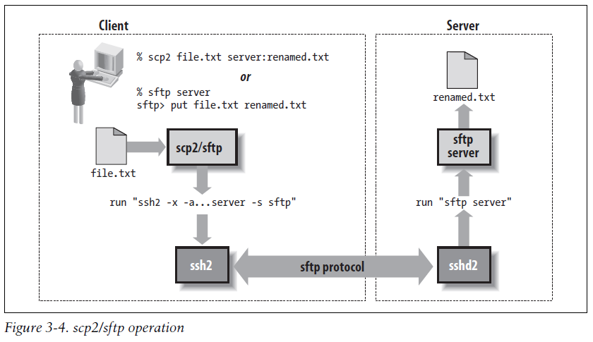
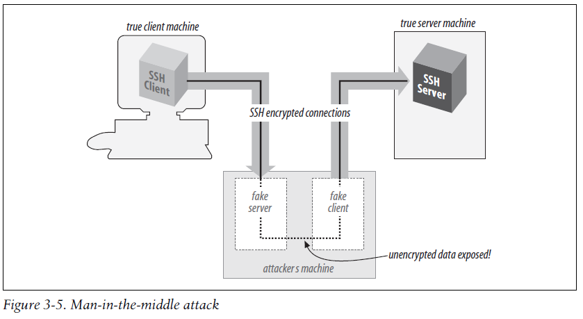

# SSH - The Secure Shell - The Definitive Guide

## 1. Introduction to SSH
## 2. Basic Client Use
## 3. Inside SSH
## 4. Installation and Compile-Time Configuration
## 5. Serverwide Configuration
## 6. Key Management and Agents
## 7. Advanced Client Use
## 8. Per-Account Server Configuration
## 9. Port Forwarding and X Forwarding
## 10. A Recommended Setup
## 11. Case Studies
## 12. Troubleshooting and FAQ
## 13. Overview of Other Implementations
## 14. OpenSSH for Windows
## 15. OpenSSH for Macintosh
## 16. Tectia for Windows
## 17. SecureCRT and SecureFX for Windows
## 18. PuTTY for Windows

---
---

# 1. Introduction to SSH

## What is SSH ?

SSH, the Secure Shell, is a popular, powerful, software-based approach to network security.* Whenever data is sent by a computer to the network, SSH automatically encrypts (scrambles) it. Then, when the data reaches its intended recipient, SSH automatically decrypts (unscrambles) it. The result is transparent encryption: users can work normally, unaware that their communications are safely encrypted on the network. In addition, SSH uses modern, secure encryption algorithms and is effective enough to be found within mission-critical applications at major corporations.

SSH has a client/server architecture, as shown in Figure 1-1. An SSH server program, typically installed and run by a system administrator, accepts or rejects incoming connections to its host computer. Users then run SSH client programs, typically on other computers, to make requests of the SSH server, such as “Please log me in,” “Please send me a file,” or “Please execute this command.” All communications between clients and servers are securely encrypted and protected from modification.


Our description is simplified but should give you a general idea of what SSH does. We’ll go into depth later. For now, just remember that SSH clients communicate with SSH servers over encrypted network connections.

Many SSH clients are inspired by old Unix programs called the “r-commands:” rsh (remote shell), rlogin (remote login), and rcp (remote copy). In fact, for many purposes the SSH clients are drop-in replacements for the r-commands, so if you’re still using them, switch to SSH immediately! The old r-commands are notoriously insecure, and the SSH learning curve is small.

## What SSH is not ?

Although SSH stands for Secure Shell, it is not a true shell in the sense of the Unix Bourne shell and C shell. It is not a command interpreter, nor does it provide wildcard expansion, command history, and so forth. Rather, SSH creates a channel for running a shell on a remote computer, with end-to-end encryption between the two systems.

SSH is also not a complete security solution—but then, nothing is. It won’t protect computers from active break-in attempts or denial-of-service attacks, and it won’t eliminate other hazards such as viruses, Trojan horses, and coffee spills. It does, however, provide robust and user-friendly encryption and authentication.

## The SSH Protocol

SSH is a protocol, not a product. It is a specification of how to conduct secure communication over a network. Although we say “the SSH protocol,” there are actually two incompatible versions of the protocols in common use: SSH-1 (a.k.a. SSH-1.5) and SSH-2. We distinguish these protocols later.

The SSH protocol covers authentication, encryption, and the integrity of data transmitted over a network, as shown in Figure 1-2. Let’s define these terms:

* Authentication
    * Reliably determines someone’s identity. If you try to log into an account on a remote computer, SSH asks for digital proof of your identity. If you pass the test, you may log in; otherwise, SSH rejects the connection.
* Encryption
    * Scrambles data so that it is unintelligible except to the intended recipients. This protects your data as it passes over the network.
* Integrity
    * Guarantees the data traveling over the network arrives unaltered. If a third party captures and modifies your data in transit, SSH detects this fact.


In short, SSH makes network connections between computers, with strong guarantees that the parties on both ends of the connection are genuine. It also ensures that any data passing over these connections arrives unmodified and unread by eavesdroppers.

## Protocols, Products, Clients, and Confusion

The first SSH product, created by Tatu Ylönen for Unix, was simply called “SSH.” This caused confusion because SSH was also the name of the protocol. In this book, we use more precise terminology to refer to protocols, products, and programs, summarized in the sidebar “Terminology: SSH Protocols and Products.” In short:

* Protocols are denoted with dashes: SSH-1, SSH-2.
*  Products are denoted in mixed case, without dashes: OpenSSH, Tectia, PuTTY, etc.
* Client programs are in lowercase: ssh, scp, putty, etc.

## Terminology: SSH Protocols and Products

* SSH
    * A generic term referring to SSH protocols and software products.
* SSH-1
    * The SSH protocol, Version 1. This is the original protocol, and it has serious limitations, so we do not recommend its use anymore.
* SSH-2
    * The SSH protocol, Version 2, the most common and secure SSH protocol used today. It is defined by draft standards documents of the IETF SECSH working group. [3.4]
* SSH1
    * The granddaddy of it all: the original SSH product created by Tatu Ylönen. It implemented (and defined) the SSH-1 protocol and is now obsolete.
* SSH2
    * The original SSH-2 product, created by Tatu Ylönen and his company, SSH Communications
* ssh (all lowercase letters)
    * A client program run on the command line and included in many SSH products, for running secure terminal sessions and remote commands. On some systems it might be named ssh1 or ssh2.
* OpenSSH
    * The product OpenSSH from the OpenBSD project, http://www.openssh.com.
* Tectia
    * The successor to SSH2, this refers to the product suite “SSH Tectia” from SSH Communications Security. We abbreviate the name as simply “Tectia.” Since Tectia is available for both Unix and Windows, when we write “Tectia” we generally mean the Unix version unless we say otherwise.

## Overview of SSH Features

### Secure Remote Logins

Suppose you have login accounts on several computers on the Internet. Common programs like telnet let you log into one computer from another, say, from your home PC to your web hosting provider, or from one office computer to another. Unfortunately, telnet and similar programs transmit your username and password in plain text over the Internet, where a malicious third party can intercept them. Additionally, your entire telnet session is readable by a network snooper.

SSH completely avoids these problems. Rather than running the insecure telnet program, you run the SSH client program ssh. To log into an account with the username smith on the remote computer host.example.com, use this command:

```bash
$ ssh -l smith host.example.com
```

The client authenticates you to the remote computer’s SSH server using an encrypted connection, meaning that your username and password are encrypted before they leave the local machine. The SSH server then logs you in, and your entire login session is encrypted as it travels between client and server. Because the encryption is transparent, you won’t notice any differences between telnet and the telnet-like SSH client.

### Terminology: Networking

* Local computer (local host, local machine)
* A computer on which you are logged in and, typically, running an SSH client.
* Remote computer (remote host, remote machine)
* A second computer you connect to via your local computer. Typically, the remote computer is running an SSH server and is accessed via an SSH client. As a degenerate case, the local and remote computers can be the same machine.
* Local user
* A user logged into a local computer.
* Remote user
* A user logged into a remote computer.
* Server
* An SSH server program.
* Server machine
* A computer running an SSH server program. We sometimes simply write “server” for the server machine when the context makes clear (or irrelevant) the distinction between the running SSH server program and its host machine.
* Client
* An SSH client program.
* Client machine
* A computer running an SSH client. As with the server terminology, we simply write “client” when the context makes the meaning clear.
* ~ or $HOME
* A user’s home directory on a Unix machine, particularly when used in a file path such as ~/filename. Most shells recognize ~ as a user’s home directory, with the notable exception of the Bourne shell. $HOME is recognized by all shells.

### Secure File Transfer

Suppose you have accounts on two Internet computers, me@firstaccount.com and metoo@secondaccount.com, and you want to transfer a file from the first to the second account. The file contains trade secrets about your business, however, that must be kept from prying eyes. A traditional file-transfer program, such as ftp, doesn’t provide a secure solution. A third party can intercept and read the packets as they travel over the network. To get around this problem, you can encrypt the file on firstaccount.com with a program such as Pretty Good Privacy (PGP), transfer it via traditional means, and decrypt the file on secondaccount.com, but such a process is tedious and nontransparent to the user.

Using SSH, the file can be transferred securely between machines with a single secure copy command. If the file were named myfile, the command executed on firstaccount.com might be:

```bash
$ scp myfile metoo@secondaccount.com:
```

When transmitted by scp, the file is automatically encrypted as it leaves firstaccount. com and decrypted as it arrives on secondaccount.com.

### Secure Remote Command Execution

Suppose you are a system administrator who needs to run the same command on many computers. You’d like to view the active processes for each user on four different computers—grape, lemon, kiwi, and melon—on a local area network using the Unix command /usr/bin/w. Many SSH clients can run a single remote command if you provide it at the end of the command line. This short shell script does the trick:

```bash
#!/bin/sh
for machine in grape lemon kiwi melon
do
    ssh $machine /usr/bin/w Execute remote command by ssh
done
```

Each w command and its results are encrypted as they travel across the network, and strong authentication techniques may be used when connecting to the remote machines.

### Key and Agents

Suppose you have accounts on many computers on a network. For security reasons, you prefer different passwords on all accounts; but remembering so many passwords is difficult. It’s also a security problem in itself. The more often you type a password, the more likely you’ll mistakenly type it in the wrong place. (Have you ever accidentally typed your password instead of your username, visible to the world? Ouch! And on many systems, such mistakes are recorded in a system log file, revealing your password in plain text.) Wouldn’t it be great to identify yourself only once and get secure access to all the accounts without continually typing passwords?

SSH has various authentication mechanisms, and the most secure is based on keys rather than passwords. Keys are discussed in great detail in Chapter 6, but for now we define a key as a small blob of bits that uniquely identifies an SSH user. For security, a key is kept encrypted; it may be used only after entering a secret passphrase to decrypt it.

Using keys, together with a program called an authentication agent, SSH can authenticate you to all your computer accounts securely without requiring you to memorize many passwords or enter them repeatedly. It works like this:

1. In advance (and only once), place special, nonsecure files called public key files into your remote computer accounts. These enable your SSH clients (ssh, scp) to access your remote accounts.
2. On your local machine, invoke the ssh-agent program, which runs in the background.
3. Choose the key (or keys) you will need during your login session.
4. Load the keys into the agent with the ssh-add program. This requires knowledge of each key’s secret passphrase.

At this point, you have an ssh-agent program running on your local machine, holding your secret keys in memory. You’re now done. You have passwordless access to all your remote accounts that contain your public key files. Say goodbye to the tedium of retyping passwords! The setup lasts until you log out from the local machine or terminate ssh-agent.

### Access Control

Suppose you want to permit another person to use your computer account, but only for certain purposes. For example, while you’re out of town you’d like your secretary to read your email but not to do anything else in your account. With SSH, you can give your secretary access to your account without revealing or changing your password, and with only the ability to run the email program. No system-administrator privileges are required to set up this restricted access. (This topic is the focus of Chapter 8.)

### Port Forwarding

SSH can increase the security of other TCP/IP-based applications such as telnet, ftp, and the X Window System. A technique called port forwarding or tunneling reroutesa TCP/IP connection to pass through an SSH connection, transparently encrypting it end to end. Port forwarding can also pass such applications through network firewalls that otherwise prevent their use.

Suppose you are logged into a machine away from work and want to access the internal news server at your office, news.yoyodyne.com. The Yoyodyne network is connected to the Internet, but a network firewall blocks incoming connections to most ports, particularly port 119, the news port. The firewall does allow incoming SSH connections, however, since the SSH protocol is secure enough that even Yoyodyne’s rabidly paranoid system administrators trust it. SSH can establish a secure tunnel on an arbitrary local TCP port—say, port 3002—to the news port on the remote host. The command might look a bit cryptic at this early stage, but here it is:

```bash
$ ssh -L 3002:localhost:119 news.yoyodyne.com
```

This says “ssh, please establish a secure connection from TCP port 3002 on my local machine to TCP port 119, the news port, on news.yoyodyne.com.” So, in order to read news securely, configure your news-reading program to connect to port 3002 on your local machine. The secure tunnel created by ssh automatically communicates with the news server on news.yoyodyne.com, and the news traffic passing through the tunnel is protected by encryption.

## Pretty Good Privacy (PGP) and GNU Privacy Guard (GnuPG)

PGP is a popular encryption program available for many computing platforms, created by Phil Zimmerman. It can authenticate users and encrypt data files and email messages. GnuPG is a more powerful successor to PGP with less-restrictive licensing.

SSH incorporates some of the same encryption algorithms as PGP and GnuPG, but applied in a different way. PGP is file-based, typically encrypting one file or email message at a time on a single computer. SSH, in contrast, encrypts an ongoing session between networked computers. The difference between PGP and SSH is like that between a batch job and an interactive process.

PGP and SSH are related in another way as well: Tectia can optionally use PGP keys for authentication

# 2. Basic Client Use

## A Running Example

Suppose you’re out of town on a business trip and want to access your files, which sit on a Unix machine belonging to your ISP, shell.isp.com. A friend at a nearby university agrees to let you log into her Linux account on the machine local.university. edu, and then remotely log into yours. For the remote login you could use the telnet program, but as we’ve seen, this connection between the machines is insecure. (No doubt some subversive college student would grab your password and turn your account into a renegade web server for pirated software and death metal MP3s.) Fortunately, both your friend’s machine and your ISP’s have an SSH product installed. In the example running through the chapter, we represent the shell prompt of the local machine, local.university.edu, as a dollar sign ($) and the prompt on shell.isp.com as shell.isp.com>.

## Remote Terminal Sessions wit hssh

Suppose your remote username on shell.isp.com is pat. To connect to your remote account from your friend’s account on local.university.edu, you type:

```bash
$ ssh -l pat shell.isp.com
pat's password: ******
Last login: Mon Aug 16 19:32:51 2004 from quondam.nefertiti.org
You have new mail.
shell.isp.com>
```

This leads to the situation shown in Figure 2-1. The ssh command runs a client that contacts the SSH server on shell.isp.com over the Internet, asking to be logged into the remote account with username pat. You can also provide user@host syntax instead of the –l option to accomplish the same thing:

```bash
ssh pat@shell.isp.com
```


On first contact, SSH establishes a secure channel between the client and the server so that all transmissions between them are encrypted. The client then prompts for your password, which it supplies to the server over the secure channel. The server authenticates you by checking that the password is correct and permits the login. All subsequent client/server exchanges are protected by that secure channel, including everything you type into the SSH application and everything it displays to you from shell.isp.com.

It’s important to remember that the secure channel exists only between the SSH client and server machines. After logging into shell.isp.com via ssh, if you then telnet or ftp to a third machine, insecure.isp.com, the connection between shell.isp.com and insecure.isp.com is not secure. However, you can run another ssh client from shell.isp. com to insecure.isp.com, creating another secure channel, which keeps the chain of connections secure.

## File Transfers with scp

Continuing the story, suppose that while browsing your files, you encounter a PDF file you’d like to print. In order to send the file to a local printer at the university, you must first transfer the file to local.university.edu. Once again, you reject as insecure the traditional file-transfer programs, such as ftp. Instead, you use another SSH client program, scp, to copy the file across the network via a secure channel.

First, you write the attachment to a file in your home directory on shell.isp.com using your mail client, naming the file printme.pdf. When you’ve finished reading your other email messages, log out of shell.isp.com, ending the SSH session and returning to the shell prompt on local.university.edu. You’re now ready to copy the file securely.

The scp program has syntax much like the traditional Unix cp program for copying files.* It is roughly:

```bash
$ scp name-of-source name-of-destination
```

In this example, scp copies the file printme.pdf on shell.isp.com over the network to a local file in your friend’s account on local.university.edu, also called printme.pdf:

```bash
$ scp pat@shell.isp.com:printme.pdf printme.pdf
```

The file is transferred over an SSH-secured connection. The source and destination files may be specified not only by filename, but also by username (“pat” in our example) and hostname (shell.isp.com), indicating the location of the file on the network. Depending on your needs, various parts of the source or destination name can be omitted, and default values used. For example, omitting the username and the at sign (pat@) makes scp assume that the remote username is the same as the local one.

Like ssh, scp prompts for your remote password and passes it to the SSH server for verification. If successful, scp logs into the pat account on shell.isp.com, copies your remote file printme.pdf to the local file printme.pdf, and logs out of shell.isp.com. The local file printme.pdf may now be sent to a printer.

The destination filename need not be the same as the remote one. For example, if you’re feeling French, you could call the local file imprime-moi.pdf:

```bash
$ scp pat@shell.isp.com:printme.pdf imprime-moi.pdfj
```

The full syntax of scp can represent local and remote files in powerful ways, and the program also has numerous command-line options.

## Known Hosts

The first time an SSH client encounters a new remote machine, it may report that it’s never seen the machine before, printing a message like the following:

```bash
$ ssh -l pat shell.isp.com
The authenticity of host 'shell.isp.com (192.168.0.2)' can't be established.
RSA key fingerprint is 77:a5:69:81:9b:eb:40:76:7b:13:04:a9:6c:f4:9c:5d.
Are you sure you want to continue connecting (yes/no)?
```

Assuming you respond yes (the most common response), the client continues:

> Warning: Permanently added 'shell.isp.com,192.168.0.2' (RSA) to the list of known hosts.

This message appears only the first time you contact a particular remote host. The message is a security feature related to SSH’s concept of known hosts. (Depending on your client configuration, ssh might print a different message and automatically accept or reject the connection.)

Suppose an adversary wants to obtain your password. He knows you are using SSH, and so he can’t monitor your connection by eavesdropping on the network. Instead, he subverts the naming service used by your local host so that the name of your intended remote host, shell.isp.com, translates falsely to the IP address of a computer run by him! He then installs an altered SSH server on the phony remote host and waits. When you log in via your trusty SSH client, the altered SSH server records your password for the adversary’s later use (or misuse, more likely). The bogus server can then disconnect with a preplanned error message such as “System down for maintenance—please try again after 4:00 p.m.” Even worse, it can fool you completely by using your password to log into the real shell.isp.com and transparently pass information back and forth between you and the server, monitoring your entire session. This hostile strategy is called a man-in-the-middle attack. Unless you think to check the originating IP address of your session on the server, you might never notice the deception.

The SSH known-host mechanism prevents such attacks. When an SSH client and server make a connection, each of them proves its identity to the other. Yes, not only does the server authenticate the client, as we saw earlier when the server checked Pat’s password, but the client also authenticates the server by public-key cryptography. In short, each SSH server has a secret, unique ID, called a host key, to identify itself to clients. The first time you connect to a remote host, a public counterpart of the host key gets copied and stored in your local account (assuming you responded “yes” to the client’s prompt about host keys, earlier). Each time you reconnect to that remote host, the SSH client checks the remote host’s identity using this public key.

Of course, it’s better to have recorded the server’s public host key before connecting to it the first time, since otherwise you are technically open to a man-in-the-middle attack that first time. Administrators can maintain systemwide known-hosts lists for given sets of hosts, but this doesn’t do much good for connecting to random new hosts around the world. Until a reliable, widely deployed method of verifying such keys securely exists (such as secure DNS, or X.509-based public-key infrastructure), this record-on-first-use mechanism is an acceptable compromise.

If authentication of the server fails, various things may happen depending on the reason for failure and the SSH configuration. Typically a warning appears on the screen, ranging from a repeat of the known-hosts message:

> Host key not found from the list of known hosts. Are you sure you want to continue connecting (yes/no)?

to more dire words:

```
@@@@@@@@@@@@@@@@@@@@@@@@@@@@@@@@@@@@@@@@@@@@@@@@@@@@@@@@@@@
@ WARNING: REMOTE HOST IDENTIFICATION HAS CHANGED! @
@@@@@@@@@@@@@@@@@@@@@@@@@@@@@@@@@@@@@@@@@@@@@@@@@@@@@@@@@@@
IT IS POSSIBLE THAT SOMEONE IS DOING SOMETHING NASTY!
Someone could be eavesdropping on you right now (man-in-the-middle attack)!
It is also possible that the RSA host key has just been changed.
The fingerprint for the RSA key sent by the remote host is
77:a5:69:81:9b:eb:40:76:7b:13:04:a9:6c:f4:9c:5d.
Please contact your system administrator.
Add correct host key in /home/smith/.ssh/known_hosts to get rid of this message.
Offending key in /home/smith/.ssh/known_hosts:36
```

If you answer yes, ssh allows the connection, but disables various features as a security precaution and doesn’t update your personal known-hosts database with the new key; you must do that yourself to make this message go away.

As the text of the message says, if you see this warning, you aren’t necessarily being hacked: for example, the remote host key may have legitimately changed for some reason. In some cases, even after reading this book, you won’t know the cause of these messages. If you need assistance, contact your system administrator or a knowledgeable friend, rather than take a chance and possibly compromise your password. We’ll cover these issues further when we discuss personal known hosts databases and how to alter the behavior of SSH clients with respect to host keys.

## The Escape Character

Let us return to the shell.isp.com example, just after you’d discovered the attachment in your remote email message and saved it to the remote file printme.pdf. In our original example, you then logged out of shell.isp.com and ran scp to transfer the file. But what if you don’t want to log out? If you’re using a workstation running a window system, you can open a new window and run scp. But if you’re using a lowly text terminal, or you’re not familiar with the window system running on your friend’s computer, there is an alternative. You can temporarily interrupt the SSH connection, transfer the file (and run any other local commands you desire), and then resume the connection.

ssh supports an escape character, a designated character that gets the attention of the SSH client. Normally, ssh sends every character you type to the server, but the escape character is caught by the client, alerting it that special commands may follow. By default, the escape character is the tilde (~), but you can change it. To reduce the chances of sending the escape character unintentionally, that character must be the first character on the command line, i.e., following a newline (Control-J) or return (Control-M) character. If not, the client treats it literally, not as an escape character. After the escape character gets the client’s attention, the next character entered determines the effect of the escape. For example, the escape character followed by a Control-Z suspends ssh like any other shell job, returning control to the local shell. Such a pair of characters is called an escape sequence. We cover these in detail in a later chapter.

To change the ssh escape character, use the –e command-line option. For example, type the following to make the percent sign (%) the escape character when connecting to shell.isp.com as user pat:

```bash
$ ssh -e "%" -l pat shell.isp.com
```

## Authentication by Cryptographic Key

In our running example, the user pat is authenticated by the SSH server via login password. Passwords, however, have serious drawbacks:

* In order for a password to be secure, it should be long and random, but such passwords are hard to memorize.
* A password sent across the network, even protected by an SSH secure channel, can be captured when it arrives on the remote host if that host has been compromised.
*  Most operating systems support only a single password per account. For shared accounts (e.g., a superuser account), this presents difficulties:
    * Password changes are inconvenient because the new password must be communicated to all people with access to the account.
    * Tracking usage of the account becomes difficult because the operating system doesn’t distinguish between the different users of the account.

To address these problems, SSH supports public-key authentication: instead of relying on the password scheme of the host operating system, SSH may use cryptographic keys. Keys are more secure than passwords in general and address all the weaknesses mentioned earlier.

## A Brief Introduction to Keys

A key is a digital identity. It’s a unique string of binary data that means “This is me, honestly, I swear.” And with a little cryptographic magic, your SSH client can prove to a server that its key is genuine, and you are really you.

An SSH identity uses a pair of keys, one private and one public. The private key is a closely guarded secret only you have. Your SSH clients use it to prove your identity to servers. The public key is, like the name says, public. You place it freely into your accounts on SSH server machines. During authentication, the SSH client and server have a little conversation about your private and public key. If they match (according to a cryptographic test), your identity is proven, and authentication succeeds.

The following sequence demonstrates the conversation between client and server. (It occurs behind the scenes, so you don’t need to memorize it or anything; we just thought you might be interested.)

1. Your client says, “Hey server, I’d like to connect by SSH to an account on your system, specifically, the account owned by user smith.”

2. The server says, “Well, maybe. First, I challenge you to prove your identity!” And the server sends some data, known as a challenge, to the client.

3. Your client says, “I accept your challenge. Here is proof of my identity. I made it myself by mathematically using your challenge and my private key.” This response to the server is called an authenticator.

4. The server says, “Thanks for the authenticator. I will now examine the smith account to see if you may enter.” Specifically, the server checks smith’s public keys to see if the authenticator “matches” any of them. (The “match” is another cryptographic operation.) If so, the server says, “OK, come on in!” Otherwise, the authentication fails.

Before you can use public-key authentication, some setup is required:

* You need a private key and a public key, known collectively as a key pair. You also need a secret passphrase to protect your private key.

* You need to install your public key on an SSH server machine.

## Generating Key Pairs with ssh-keygen

To use cryptographic authentication, you must first generate a key pair for yourself, consisting of a private key (your digital identity that sits on the client machine) and a public key (that sits on the server machine). To do this, use the ssh-keygen program to produce either a DSA or RSA key. The OpenSSH version of ssh-keygen requires you to specify the key type with the –t option (there is no default):

```bash
$ ssh-keygen -t dsa
Generating public/private dsa key pair.
Enter file in which to save the key (/home/dbarrett/.ssh/id_dsa): press ENTER
Enter passphrase (empty for no passphrase): ********
Enter same passphrase again: ********
Your identification has been saved in /home/pat/.ssh/id_dsa.
Your public key has been saved in /home/pat/.ssh/id_dsa.pub.
The key fingerprint is:
14:ba:06:98:a8:98:ad:27:b5:ce:55:85:ec:64:37:19 pat@shell.isp.com
```

On Tectia systems, ssh-keygen produces a DSA key by default, and also accepts the –t option:

```bash
$ ssh-keygen
Generating 2048-bit dsa key pair
1 ..oOo.oOo.oO
2 o.oOo.oOo.oO
3 o.oOo.oOo.oO
The program displays a “ripple” pattern to indicate progress; the characters are actually
overwritten on a single line
28 o.oOo.oOo.oO
Key generated.
2048-bit dsa, pat@shell.isp.com, Wed Jan 12 2005 20:22:21 -0500
Passphrase : **************
Again : **************
Private key saved to /home/pat/.ssh2/id_dsa_2048_a
Public key saved to /home/pat/.ssh2/id_dsa_2048_a.pub
```

Normally, ssh-keygen performs all necessary mathematics to generate a key, but on some operating systems you might be asked to assist it. Key generation requires some random numbers, and if your operating system doesn’t supply a random-number generator, you may be asked to type some random text or wiggle your mouse around. ssh-keygen uses the timings of your keystrokes to initialize its internal random-number generator. On a 3.2 GHz Pentium 4 system running Linux, a 1024- bit RSA key generates in less than one second; if your hardware is slower or heavily loaded, generation could take minutes. It can also take longer if the process runs out of random bits and ssh-keygen waits to collect more.

ssh-keygen then creates your local SSH directory (~/.ssh for OpenSSH or ~/.ssh2 for Tectia) if it doesn’t already exist, and stores the private and public components of the generated key in two files there. By default, their names are id_dsa and id_dsa.pub (OpenSSH) or id_dsa_2048_a and id_dsa_2048_a.pub (Tectia). SSH clients consider these to be your default identity for authentication purposes.

> Never reveal your private key and passphrase to anyone. They are just as sensitive as your login password. Anyone possessing them can impersonate you!

When created, the identity file is readable only by your account, and its contents are further protected by encrypting them with the passphrase you supplied during generation. We say “passphrase” instead of “password” both to differentiate it from a login password, and to stress that spaces and punctuation are allowed and encouraged. We recommend a passphrase at least 10–15 characters long and not a grammatical sentence.

ssh-keygen has numerous options for managing keys: changing the passphrase, choosing a different name for the key file, and so forth.

## Installing a Public Key on an SSH Server Machine

When passwords are used for authentication, the host operating system maintains the association between the username and the password. For cryptographic keys, you must set up a similar association manually. After creating the key pair on the local host, you must install your public key in your account on the remote host. A remote account may have many public keys installed for accessing it in various ways.

Returning to our running example, you must install a public key into the pat account on shell.isp.com. This is done by editing a file in the SSH configuration directory: ~/.ssh/ authorized_keys for OpenSSH or ~/.ssh2/authorization for Tectia.

## Public-Key Authentication

Public-key authentication is more secure than password authentication because:


* It requires two secret components—the identity file on disk, and the passphrase in your head—so both must be captured in order for an adversary to access your account. Password authentication requires only one component, the password, which might be easier to steal.
*  Neither the passphrase nor the key is sent to the remote host, just the authenticator discussed earlier. Therefore, no secret information is transmitted off the client machine.
*  Machine-generated cryptographic keys are infeasible to guess. Human-generated passwords are routinely cracked by a password-guessing technique called a dictionary attack. A dictionary attack may be mounted on the passphrase as well, but this requires stealing the private-key file first.

A host’s security can be greatly increased by disabling password authentication altogether and permitting only SSH connections by key.

## If You Change Your Key

Suppose you have generated a key pair, id_dsa and id_dsa.pub, and copied id_dsa.pub to a bunch of SSH server machines. All is well. Then one day, you decide to change your identity, so you run ssh-keygen a second time, overwriting id_dsa and id_dsa. pub. Guess what? Your previous public-key file is now invalid, and you must copy the new public key to all those SSH server machines again. This is a maintenance headache, so think carefully before changing (destroying!) a key pair. Some caveats:

* You are not limited to one key pair. You can generate as many as you like, stored in different files, and use them for diverse purposes.
* If you just want to change your passphrase, you don’t have to generate a new key pair. ssh-keygen has command-line options for replacing the passphrase of an existing key: –p for OpenSSH and –e for Tectia. In this case your public key remains valid since the private key hasn’t changed, just the passphrase for decrypting it.

## The SSH Agent

Each time you run ssh or scp with public-key authentication, you have to retype your passphrase. The first few times you might not mind, but eventually this retyping gets annoying. Wouldn’t it be nicer to identify yourself just once and have ssh and scp remember your identity until further notice (for example, until you log out), not prompting for your passphrase? In fact, this is just what an SSH agent does for you.

An agent is a program that keeps private keys in memory and provides authentication services to SSH clients. If you preload an agent with private keys at the beginning of a login session, your SSH clients won’t prompt for passphrases. Instead, they communicate with the agent as needed. The effects of the agent last until you terminate the agent, usually just before logging out. The agent program for both OpenSSH and Tectia is called ssh-agent.

Generally, you run a single ssh-agent in your local login session, before running any SSH clients. You can run the agent by hand, but people usually edit their login files (for example, ~/.login or ~/.xsession) to run the agent automatically. SSH clients communicate with the agent via a local socket or named pipe whose filename is stored in an environment variable, so all clients (and all other processes) within your login session have access to the agent. To try the agent, type:

```bash
$ ssh-agent $SHELL
```

where SHELL is the environment variable containing the name of your login shell. Alternatively, you could supply the name of any other shell, such as sh, bash, csh, tcsh, or ksh. The agent runs and then invokes the given shell as a child process. The visual effect is simply that another shell prompt appears, but this shell has access to the agent.

Once the agent is running, it’s time to load private keys into it using the ssh-add program. By default, ssh-add loads the key from your default identity file:

```bash
$ ssh-add
Enter passphrase for /home/you/.ssh/id_dsa: ********
Identity added: /home/you/.ssh/id_dsa (/home/you/.ssh/id_dsa)
```

Now ssh and scp can connect to remote hosts without prompting for your passphrase. Figure 2-3 shows the process.

ssh-add reads the passphrase from your terminal by default or, optionally, from standard input noninteractively. Otherwise, if you are running the X Window System with the DISPLAY environment variable set, and standard input isn’t a terminal, sshadd reads your passphrase using a graphical X program, ssh-askpass. This behavior is useful when calling ssh-add from X session setup scripts.

To force ssh-add to use X to read the passphrase, type ssh-add < /dev/ null at a command line.


ssh-add has further capabilities and can operate with multiple identity files. For now, here are a few useful commands. To load a key other than your default identity into the agent, provide the filename as an argument to ssh-add:

```bash
$ ssh-add my-other-key-file
```

You can also list the keys the agent currently holds:

```bash
$ ssh-add -l
```

delete a key from the agent in memory:

```bash
$ ssh-add -d name-of-key-file
```

or delete all keys from the agent in memory:

```bash
$ ssh-add -D
```

When running an SSH agent, don’t leave your terminal unattended while logged in. While your private keys are loaded in an agent, anyone may use your terminal to connect to any remote accounts accessible via those keys, without needing your passphrase! Even worse, a sophisticated intruder can extract your keys from the running agent and steal them.

If you use an agent, make sure to lock your terminal if you leave it while logged in. You can also use ssh-add -D to clear your loaded keys and reload them when you return. In addition, ssh-agent can be “locked” by ssh-add, to protect the agent from unauthorized users.

## Agents and Automation

Suppose you have a batch script that runs ssh to launch remote processes. If the script runs ssh many times, it prompts for your passphrase repeatedly, which is inconvenient for automation (not to mention annoying and error-prone). If you run an agent, however, your script can run without a single passphrase prompt.

## A More Complex Passphrase Problem

In our running example, we copied a file from the remote to the local host:

```bash
$ scp pat@shell.isp.com:printme.pdf imprime-moi.pdf
```

In fact, scp can copy a file from the remote host shell.isp.com directly to a third host running SSH on which you have an account named, say, “psmith”:

```bash
$ scp pat@shell.isp.com:printme.pdf psmith@other.host.net:imprime-moi.pdf
```

Rather than copying the file first to the local host and then back out again to the final destination, this command has shell.isp.com send it directly to other.host.net. However, if you try this, you run into the following problem:

```bash
$ scp pat@shell.isp.com:printme.pdf psmith@other.host.net:imprime-moi.pdf
Enter passphrase for RSA key 'Your Name <you@local.org>': ************
You have no controlling tty and no DISPLAY. Cannot read passphrase.
lost connection
```

What happened? When you run scp on your local machine, it contacts shell.isp.com and internally invokes a second scp command to do the copy. Unfortunately, the second scp command also needs the passphrase for your private key. Since there is no terminal session to prompt for the passphrase, the second scp fails, causing the original scp to fail. The SSH agent solves this problem: the second scp command simply queries your local SSH agent, so no passphrase prompting is needed.

The SSH agent also solves another, more subtle, problem in this example. Without the agent, the second scp (on shell.isp.com) needs access to your private-key file, but the file is on your local machine. So, you have to copy your private key file to shell. isp.com. This isn’t ideal; what if shell.isp.com isn’t a secure machine? Also, the solution doesn’t scale: if you have a dozen different accounts, it is a maintenance headache to keep your private key file on all of them. Fortunately, the SSH agent comes to the rescue once again. The remote scp process simply contacts your local SSH agent and authenticates, and the secure copy proceeds successfully, through a process called agent forwarding.

## Agent Forwarding

In the preceding example, the remote instance of scp has no direct access to your private key, since the agent is running on the local host, not the remote host. SSH provides agent forwarding to address this problem.

When agent forwarding is turned on,* the remote SSH server masquerades as a second ssh-agent, as shown in Figure 2-4. It takes authentication requests from your SSH client processes there, passes them back over the SSH connection to the local agent for handling, and relays the results back to the remote clients. In short, remote clients transparently get access to the local ssh-agent. Since any programs executed via ssh on the remote side are children of the server, they all have access to the local agent just as if they were running on the local host.


In our double-remote scp example, here is what happens when agent forwarding comes into play (see Figure 2-5):

1. You run the command on your local machine: ```$ scp pat@shell.isp.com:printme.pdf psmith@other.host.net:imprime-moi.pdf```

2. This scp process contacts your local agent and authenticates you to shell.isp.com.

3. A second scp command is automatically launched on shell.isp.com to carry out the copy to other.host.net.

4. Since agent forwarding is turned on, the SSH server on shell.isp.com poses as an agent.

5. The second scp process tries to authenticate you to other.host.net by contacting the “agent” that is really the SSH server on shell.isp.com.

6. Behind the scenes, the SSH server on shell.isp.com communicates with your local agent, which constructs an authenticator proving your identity and passes it back to the server.

7. The server verifies your identity to the second scp process, and authentication succeeds on other.host.net.

8. The file copying occurs.


Agent forwarding works over multiple connections in a series, allowing you to ssh from one machine to another, and then to another, with the agent connection following along the whole way. These machines may be progressively less secure, but agent forwarding doesn’t send your private key to the remote host: it just relays authentication requests back to the first host for processing. Therefore, you don’t have to copy your private key to other machines.

## Connecting Without a Password or Passphrase

One of the most frequently asked questions about SSH is: “How can I connect to a remote machine without having to type a password or passphrase?” As you’ve seen, an SSH agent can make this possible, but there are other methods as well, each with different trade-offs. Here we list the available methods with pointers to the sections discussing each one.

To use SSH clients for interactive sessions without a password or passphrase, you have several options:

* Public-key authentication with an agent

* Hostbased authentication

* Kerberos authentication

Another way to achieve passwordless logins is to use an unencrypted private key with no passphrase. Although this technique can be appropriate for automation purposes, never do this for interactive use. Instead, use the SSH agent, which provides the same benefits with much greater security. Don’t use unencrypted keys for interactive SSH!

On the other hand, noninteractive, unattended programs such as cron jobs or batch scripts may also benefit from not having a password or passphrase. In this case, the different techniques raise some complex issues, and we discuss their relative merits and security issues later

# 3. Inside SSH

## Overview of features

The major features and guarantees of the SSH protocol are:

* Privacy of your data, via strong encryption
* Integrity of communications, guaranteeing they haven’t been altered
* Authentication, i.e., proof of identity of senders and receivers
* Authorization, i.e., access control to accounts
* Forwarding or tunneling to encrypt other TCP/IP-based sessions

## Privacy (Encryption)

Privacy means protecting data from disclosure. Typical computer networks don’t guarantee privacy; anyone with access to the network hardware, or to hosts connected to the network, may be able to read (or sniff ) all data passing over the network. Although modern switched networks have reduced this problem in local area networks, it is still a serious issue; passwords are easily stolen by such sniffing attacks.

SSH provides privacy by encrypting data that passes over the network. This end-toend encryption is based on random keys that are securely negotiated for that session and then destroyed when the session is over. SSH supports a variety of encryption algorithms for session data, including such standard ciphers as AES, ARCFOUR, Blowfish, Twofish, IDEA, DES, and triple-DES (3DES).

## Integrity

Integrity means assuring that data transmitted from one end of a network connection arrives unaltered on the other end. The underlying transport of SSH, TCP/IP, does have integrity checking to detect alteration due to network problems (electrical noise, lost packets due to excessive traffic, etc.). Nevertheless, these methods are ineffective against deliberate tampering and can be fooled by a clever attacker. Even though SSH encrypts the data stream so that an attacker can’t easily change selected parts to achieve a specific result, TCP/IP’s integrity checking alone can’t prevent, say, an attacker’s deliberate injection of garbage into your session.

A more complex example is a replay attack. Imagine that Attila the Attacker is monitoring your SSH session and also simultaneously watching over your shoulder (either physically, or by monitoring your keystrokes at your terminal). In the course of your work, Attila sees you type the command rm -rf * within a small directory. He can’t read the encrypted SSH session data, of course, but he could correlate a burst of activity on that connection with your typing the command, and capture the packets containing the encrypted version of your command. Later, when you’re working in your home directory, Attila inserts the captured bits into your SSH session, and your terminal mysteriously erases all your files!

Attila’s replay attack succeeds because the packets he inserted are valid; he could not have produced them himself (due to the encryption), but he can copy and replay them later. TCP/IP’s integrity check is performed only on a per-packet basis, so it can’t detect Attila’s attack. Clearly, the integrity check must apply to the data stream as a whole, ensuring that the bits arrive as they were sent: in order and with no duplication.

The SSH protocol uses cryptographic integrity checking, which verifies both that transmitted data hasn’t been altered and that it truly comes from the other end of the connection. It uses keyed hash algorithms based on MD5 and SHA-1 for this purpose: well-known, widely trusted algorithms.

## Authentication

Authentication means verifying someone’s identity. Suppose I claim to be Richard Silverman, and you want to authenticate that claim. If not much is at stake, you might just take my word for it. If you’re a little concerned, you might ask for my driver’s license or other photo ID. If you’re a bank officer deciding whether to open a safe-deposit box for me, you might also require that I possess a physical key, and so on. It all depends on how sure you want to be. The arsenal of high-tech authentication techniques is growing constantly and includes DNA-testing microchips, retina and hand scanners, and voice-print analyzers.

Every SSH connection involves two authentications: the client verifies the identity of the SSH server (server authentication), and the server verifies the identity of the user requesting access (user authentication). Server authentication ensures that the SSH server is genuine, not an impostor, guarding against an attacker’s redirecting your network connection to a different machine. Server authentication also protects against man-in-the-middle attacks, wherein the attacker sits invisibly between you and the server, pretending to be the client on one side and the server on the other, fooling both sides and reading all your traffic in the process!

User authentication is traditionally done with passwords, which unfortunately are a weak authentication scheme. To prove your identity you have to reveal the password, exposing it to possible theft. Additionally, in order to remember a password, people are likely to keep it short and meaningful, which makes the password easier for third parties to guess. For longer passwords, some people choose words or sentences in their native languages, and these passwords are likely to be crackable. From the standpoint of information theory, grammatical sentences contain little real information (technically known as entropy): generally less than two bits per character in English text, far less than the 8–16 bits per character found in computer encodings.

SSH supports authentication by password, encrypting the password as it travels over the network. This is a vast improvement over other common remote-access protocols (Telnet, FTP) which generally send your password in the clear (i.e., unencrypted) over the network, where anyone with sufficient network access can steal it! Nevertheless, it’s still only simple password authentication, so SSH provides other stronger and more manageable mechanisms: per-user public-key signatures, and an improved rlogin-style authentication with host identity verified by public key. In addition, various SSH implementations support some other systems, including Kerberos, RSA Security’s SecurID tokens, S/Key one-time passwords, and the Pluggable Authentication Modules (PAM) system. An SSH client and server negotiate to determine which authentication mechanism to use, based on their configurations, and a server can even require multiple forms of authentication.

## Authorization

Authorization means deciding what someone may or may not do. It occurs after authentication, since you can’t grant someone privileges until you know who she is. SSH servers have various ways of restricting clients’ actions. Access to interactive login sessions, TCP port and X Window forwarding, key agent forwarding, etc., can all be controlled, though not all these features are available in all SSH implementations, and they aren’t always as general or flexible as you might want. Authorization may be controlled at a serverwide level (e.g., the /etc/ssh/sshd_config file for OpenSSH), or per account, depending on the authentication method used (e.g., each user’s files ~/.ssh/authorized_keys, ~/.ssh2/authorization, ~/.shosts, ~/.k5login, etc.).

## Forwarding (Tunneling)

Forwarding or tunneling means encapsulating another TCP-based service, such as Telnet or IMAP, within an SSH session. This brings the security benefits of SSH (privacy, integrity, authentication, authorization) to other TCP-based services. For example, an ordinary Telnet connection transmits your username, password, and the rest of your login session in the clear. By forwarding telnet through SSH, all of this data is automatically encrypted and integrity-checked, and you may authenticate using SSH credentials. SSH supports three types of forwarding:

* TCP port forwarding
    * Secures any TCP-based service
* X forwarding
    * Secures the X11 protocol (i.e., X Windows)
* Agent forwarding
    * Permits SSH clients to use SSH private keys held on remote machines

From these basic facilities, some SSH products build more complex services, such as SOCKS proxies and special-purpose forwarders that can handle difficult protocols like FTP.

## A Cryptography Primer

We’ve covered the basic properties of SSH. Now we focus on cryptography, introducing important terms and ideas regarding the technology in general. There are many good references on cryptographic theory and practice, and we make no attempt here to be comprehensive. (For more detailed information, check out Bruce Schneier’s excellent book, Applied Cryptography, published by John Wiley & Sons.) We introduce encryption and decryption, plaintext and ciphertext, keys, secret-key and public-key cryptography, and hash functions, both in general and as they apply to SSH.

Encryption is the process of scrambling data so that it can’t be read by unauthorized parties. An encryption algorithm (or cipher) is a particular method of performing the scrambling; examples of currently popular encryption algorithms are RSA, AES, DSA, and Blowfish. The original, readable data is called the plaintext, or data “in the clear,” while the encrypted version is called the corresponding ciphertext.

The goal of an encryption algorithm is to convert plaintext to ciphertext. To do this, you pass two inputs to the encryption algorithm: the plaintext itself, and a key, a string that is typically a secret known only to you. From these inputs, the algorithm produces the ciphertext. An encryption algorithm is considered secure if it is infeasible for anyone to read (or decrypt) the encrypted ciphertext without the key. An attempt to decrypt data without its key is called cryptanalysis.

## How secure is secure ?

It’s important to understand the word “infeasible” in the previous paragraph. Today’s most popular and secure ciphers are vulnerable to brute-force attacks: if you try every possible key, you eventually succeed in decryption. However, when the number of possible keys is large, a brute-force search requires a great deal of time and computing power. Based on the state of the art in computer hardware and algorithms, it is possible to pick sufficiently large key sizes to render brute-force keysearch unreasonable for your adversary. What counts as infeasible, though, depending on how valuable the data is, how long it must stay secure, and how motivated and well-funded your adversary is. Keeping something secret from your rival startup for a few days is one thing; keeping it secret from a major world government for 10 years is quite another.

Of course, for all this to make sense, you must be convinced that brute force is the only way to attack your cipher. Encryption algorithms have structure and are susceptible to mathematical analysis. Over the years, many ciphers previously thought secure have fallen to advances in cryptanalysis. It isn’t currently possible to prove a practical cipher secure. Rather, a cipher acquires respectability through intensive study by mathematicians and cryptographers. If a new cipher exhibits good design principles, and well-known researchers study it for some time and fail to find a practical, faster method of breaking it than brute force, then people will consider it secure.

## Public- and Secret-Key Cryptography

Encryption algorithms as described so far are called symmetric or secret-key ciphers; the same key is used for encrypting and decrypting. Examples are Blowfish, AES, 3DES, and RC4. Such a cipher immediately introduces the key-distribution problem: how do you get the key to your intended recipient? If you can meet in person every once in a while and exchange a list of keys, that’s all well and good, but for dynamic communication over computer networks, this doesn’t work.

Public-key, or asymmetric, cryptography replaces the single key with a pair of related keys: public and private. They are related in a mathematically clever way: data encrypted with one key may be decrypted only with the other member of the pair, and it is infeasible to derive the private key from the public one. You keep your private key, well, private, and give the public key to anyone who wants it, without worrying about disclosure. Ideally, you publish it in a directory next to your name, like a telephone book. When someone wants to send you a secret message, they encrypt it with your public key. Other people may have your public key, but that won’t allow them to decrypt the message; only you can do that with the corresponding private key. Public-key cryptography goes a long way toward solving the key-distribution problem.

Public-key methods are also the basis for digital signatures: extra information attached to a digital document to provide evidence that a particular person has seen and agreed to it, much as a pen-and-ink signature does with a paper document. Any asymmetric cipher (RSA, ElGamal, Elliptic Curve, etc.) may be used for digital signatures, though the reverse isn’t true. For instance, the DSA algorithm is a signature- only public-key scheme and is not intended to be used for encryption. (That’s the idea, anyway, although it’s easy to use a general DSA implementation for both RSA and ElGamal encryption. That was not the intent, however.)

Secret- and public-key encryption algorithms differ in another way: performance. All common public-key algorithms are enormously slower than secret-key ciphers—by orders of magnitude. It is simply infeasible to encrypt large quantities of data using a public-key cipher. For this reason, modern data encryption uses both methods together. Suppose you want to send some data securely to your friend Bob Bitflipper. Here’s what a modern encryption program does:

1. Generate a random key, called the bulk key, for a fast, secret-key algorithm like 3DES (a.k.a. the bulk cipher).

2. Encrypt the plaintext with the bulk key.

3. Secure the bulk key by encrypting it with Bob Bitflipper’s public key, so only Bob can decrypt it. Since secret keys are small (a few hundred bits long at most), the speed of the public-key algorithm isn’t an issue.

To reverse the operation, Bob’s decryption program first decrypts the bulk key, and then uses it to decrypt the ciphertext. This method yields the advantages of both kinds of encryption technology, and in fact, SSH uses this technique. User data crossing an SSH connection is encrypted using a fast secret-key cipher, the key for which is shared between the client and server using public-key methods.

## Hash Functions

In cryptography (and elsewhere in computing and network technology), it is often useful to know if some collection of data has changed. Of course, one can just send along (or keep around) the original data for comparison, but that can be prohibitively expensive both in time and storage. The common tool addressing this need is called a hash function. Hash functions are used by SSH-1 for integrity checking (and have various other uses in cryptography we won’t discuss here).

A hash function is simply a mapping from a larger set of data values to a smaller set. For instance, a hash function H might take an input bit string of any length up to 50,000 bits, and uniformly produce a 128-bit output. The idea is that when sending a message m to Alice, I also send along the hash value H(m). Alice computes H(m) independently and compares it to the H(m) value I sent; if they differ, she concludes that the message was modified in transit.

This simple technique can’t be completely effective. Since the range of the hash function is strictly smaller than its domain, many different messages have the same hash value. To be useful, H must have the property that the kinds of alterations expected to happen to the messages in transit, must be overwhelmingly likely to cause a change in the message hash. Put another way: given a message m and a typical changed message m', it must be extremely unlikely that H(m) = H(m').

Thus, a hash function must be tailored to its intended use. One common use is in networking: datagrams transmitted over a network frequently include a message hash that detects transmission errors due to hardware failure or software bugs. Another use is in cryptography, to implement digital signatures. Signing a large amount of data is prohibitively expensive, since it involves slow public-key operations as well as shipping along a complete encrypted copy of the data. What is actually done is to first hash the document, producing a small hash value, and then sign that, sending the signed hash along instead. A verifier independently computes the hash, then decrypts the signature using the appropriate public key, and compares them. If they are the same, he concludes (with high probability) that the signature is valid, and that the data hasn’t changed since the private-key holder signed it.

These two uses, however, have different requirements, and a hash function suitable for detecting transmission errors due to line noise might be ineffective at detecting deliberate alterations introduced by a human attacker! A cryptographic hash function must make it computationally infeasible to find two different messages having the same hash or to find a message having a particular fixed hash. Such a function is said to be collision-resistant (or collision-proof, though that’s a bit misleading), and pre-image-resistant. The Cyclic Redundancy Check (CRC) hash commonly used to detect accidental data changes (e.g., in Ethernet frame transmissions) is an example of a noncollision-resistant hash. It is easy to find CRC-32 hash collisions, and a wellknown attack on SSH-1 is based on this fact. [3.5] Examples of cryptographically strong hash functions are MD5 and SHA-1.

## The Architecture of an SSH System

SSH has about a dozen distinct, interacting components that produce the features we’ve covered. [3.1] Figure 3-1 illustrates the major components and their relationships to one another.


By “component” we don’t necessarily mean “program”: SSH also has keys, sessions, and other fun things. In this section we provide a brief overview of all the components, so you can begin to get the big picture of SSH:

* Server
    * A program that allows incoming SSH connections to a machine, handling authentication, authorization, and so forth. In most Unix SSH implementations, the server is sshd.
* Client
    * A program that connects to SSH servers and makes requests, such as “log me in” or “copy this file.” In OpenSSH and Tectia, the major clients are ssh, scp, and sftp.
* Session
    * An ongoing connection between a client and a server. It begins after the client successfully authenticates to a server and ends when the connection terminates. Sessions may be interactive or batch.
* Key
    * A relatively small amount of data, generally from tens of to 1,000 or 2,000 bits, used as a parameter to cryptographic algorithms such as encryption or message authentication. The key binds the algorithm operation in some way to the key holder: in encryption, it ensures that only someone else holding that key (or a related one) can decrypt the message; in authentication, it allows you to verify later that the key holder actually signed the message. There are two kinds of keys: symmetric or secret key, and asymmetric or public key. [3.2.2] An asymmetric key has two parts: the public and private components. SSH has several types of keys, as summarized in Table 3-1.


* User key
    * A persistent, asymmetric key used by clients as proof of a user’s identity. (A single user may have many keys/identities.)
* Host key
    * A persistent, asymmetric key used by a server as proof of its identity, as well as by a client when proving its host’s identity as part of hostbased authentication. [3.4.3.6] If a machine runs a single SSH server, the host key also uniquely identifies the machine. (If a machine is running multiple SSH servers, each may have a different host key, or they may share.)
* Session key
    * A randomly generated, symmetric key for encrypting the communication between an SSH client and server. It is shared by the two parties in a secure manner during the SSH connection setup so that an eavesdropper can’t discover it. Both sides then have the session key, which they use to encrypt their communications. When the SSH session ends, the key is destroyed.

An SSH connection has several session keys: each direction (server to client, and client to server) has keys for encryption and others for integrity checking. In our discussions we treat all the session keys as a unit and speak of “the session key” for convenience; they are all derived from a single master secret, anyway. If the context requires it, we identify the individual key we mean.

* Key generator
    * A program that creates persistent keys (user keys and host keys) for SSH. OpenSSH and Tectia have the program ssh-keygen.
* Known-hosts database
    * A collection of host keys. Clients and servers refer to this database to authenticate one another.
* Agent
    * A program that caches user keys in memory, so users needn’t keep retyping their passphrases. The agent responds to requests for key-related operations, such as signing an authenticator, but it doesn’t disclose the keys themselves. It is a convenience feature. OpenSSH and Tectia have the agent ssh-agent, and the program ssh-add loads and unloads the key cache.
* Signer
    * A program that signs hostbased authentication packets. We explain this in our discussion of hostbased authentication.
* Random seed
    * A pool of random data used by SSH components to initialize software pseudorandom number generators.
* Configuration file
    * A collection of settings to tailor the behavior of an SSH client or server. Not all these components are required in an implementation of SSH. Certainly servers, clients, and keys are mandatory, but many implementations don’t have an agent, and some don’t even include a key generator.

## Inside SSH-2

The SSH protocol is actually divided into four major pieces, formally described as four separate protocols in different IETF documents, and in principle independent of one another. In practice, they are layered together to provide the set of services most users associate with SSH as a whole. These are:

* SSH Transport Layer Protocol (SSH-TRANS)
* SSH Authentication Protocol (SSH-AUTH)
* SSH Connection Protocol (SSH-CONN)
* SSH File Transfer Protocol (SSH-SFTP)

There are other documents that describe other aspects of, or extensions to, the protocols, but the preceding ones represent the core of SSH. As of this writing, these documents are still “Internet-Drafts,” but after much effort by the IETF SECSH working group, they have been submitted to the IESG for consideration as proposed standards and may soon be published as Internet RFCs.

Figure 3-2 outlines the division of labor between these protocols, and how they relate to each other, application programs, and the network. Elements in italics are protocol extensions defined in separate Internet-Draft documents, which have attained fairly widespread use.


SSH is designed to be modular and extensible. All of the core protocols define abstract services they provide and requirements they must meet, but allow multiple mechanisms for doing so, as well as a way of easily adding new mechanisms. All the critical parameters of an SSH connection are negotiable, including the methods and algorithms used in:

*  Session key exchange

* Server authentication

* Data privacy and integrity

* User authentication

* Data compression 

Client and server negotiate the use of a common set of methods, allowing broad interoperability among different implementations. In most categories, the protocol defines at least one required method, to further promote interoperability. Note that this only means a conforming implementation is required to support the method in its code; any particular method may in fact be turned off by the administrator in a particular environment. So, the fact that public-key authentication is required by SSH-AUTH doesn’t mean it’s always available to clients from any particular running SSH server; it merely means it must be available and could be turned on, if need be.

### Protocol Summary

SSH-TRANS is the fundamental building block, providing the initial connection, record protocol, server authentication, and basic encryption and integrity services. After establishing an SSH-TRANS connection, the client has a single, secure, fullduplex byte stream to an authenticated peer.

Next, the client can use SSH-AUTH over the SSH-TRANS connection to authenticate itself to the server. SSH-AUTH defines a framework within which multiple authentication mechanisms may be used, fixing such things as the format and order of authentication requests, conditions for success or failure, and how a client learns the available methods. There may be any number of actual methods implemented, and the protocol allows arbitrary exchanges as part of any particular mechanism so that protocol extensions are easily defined to incorporate any desired authentication method in the future. SSH-AUTH requires only one method: public key with the DSS algorithm. It further defines two more methods: password and hostbased. A number of other methods have been defined in various Internet-Drafts, and some of them have gained wide acceptance.

After authentication, SSH clients invoke the SSH-CONN protocol, which provides a variety of richer services over the single pipe provided by SSH-TRANS. This includes everything needed to support multiple interactive and noninteractive sessions: multiplexing several streams (or channels) over the underlying connection; managing X, TCP, and agent forwarding; propagating signals across the connection (such as SIGINT, when a user types ^C to interrupt a process); terminal handling; data compression; and remote program execution.

Finally, an application may use SSH-SFTP over an SSH-CONN channel to provide file-transfer and remote filesystem manipulation functions.

It’s important to understand that the arrangement, layering, and sequencing of these protocols is a matter of convention or need, not design; although they are typically used in a particular order, other arrangements are possible. For instance, note that SSH-CONN is not layered on top of SSH-AUTH; they are both at the same level above SSH-TRANS. Typically, an SSH server requires authentication via SSH-AUTH before allowing the client to invoke SSH-CONN—and also typically, clients want to use SSH-CONN in order to obtain the usual SSH services (remote terminal, agent forwarding, etc.). However, this need not be the case. A specialized SSH server for a particular, limited purpose might not require authentication, and hence could allow a client to invoke an application service (SSH-CONN, or perhaps some other locally defined service) immediately after establishing an SSH-TRANS connection. An anonymous SFTP server might be implemented this way, for example. However, such nonstandard protocol arrangements are probably seen only in a closed environment with custom client/server software. Since most SFTP clients in the world expect to do SSH-AUTH, they probably won’t interoperate with such a server. An anonymous SFTP server for general use would use SSH-AUTH in the usual fashion and simply report immediate success for any attempted client authentication.

That said, these protocols were conceived as a group and rely on each other in practice. For instance, SSH-SFTP on its own provides no security whatsoever; it is merely a language for conducting remote-filing operations. It’s assumed to be run over a secure transport if security is needed, such as an SSH session. However, using the sftp -S option of OpenSSH and Tectia, for example, you could connect the sftp client to an sftp-server running on another host using some other method: over a serial line, or some other secure network protocol...or rsh if you want to be perverse. Similarly, SSH-AUTH mechanisms rely on a secure underlying transport to varying degrees. The most obvious is the “password” mechanism, which simply sends the password in plaintext over the transport as part of an authentication request. Obviously, that mechanism would be disastrous over an insecure transport.

Another important point is that the SSH protocol deals only with communication “on-the-wire”—that is, its formats and conventions apply only to data being exchanged dynamically between the SSH client and server. It says nothing at all, for instance, about:

* Formats for storing keys on disk
* User authorization (e.g., ~/.ssh/authorized_keys)
* Key agents or agent forwarding

...and many other things that people typically think of as part of SSH. These facets are implementation-dependent: they are not specified by the standard, and hence may be done differently depending on what software you’re using. And in fact they do differ: OpenSSH and Tectia use different file formats for keys. Even if you convert one to the other, you’ll find that OpenSSH keys belong in ~/.ssh/authorized_keys, whereas each Tectia key goes in its own file, listed by reference in yet another file, ~/.ssh2/ authorization. And although both products sport a private-key agent—with the same name even, ssh-agent—they are incompatible.

Now that we have an overview of the major components of SSH, let’s dive in and examine each of these protocols in detail. To give structure and concreteness to an otherwise abstract description of the protocols, we frame our discussion by following a particular SSH connection from beginning to end. We follow the thread of debugging messages produced by ssh -vv, explaining the significance of the various messages and turning aside now and then to describe the protocol phases occurring at that point.

Since this –vv level of verbosity produces quite a few messages not relevant to our protocol discussion, we omit some for the sake of clarity.

## SSH Transport Layer Protocol (SSH-TRANS)

### Connection

We begin by running an SSH client in verbose mode, requesting a connection to host.foo.net:

```bash
$ ssh -vv host.foo.net
OpenSSH_3.6.1p1+CAN-2003-0693, SSH protocols 1.5/2.0, OpenSSL 0x0090702f
debug1: Reading configuration data /Users/res/.ssh/config
debug1: Applying options for com
debug1: Applying options for *
debug1: Reading configuration data /etc/ssh/ssh_config
debug1: Connecting to host.foo.net [10.1.1.1] port 22.
debug1: Connection established.
```

The client is a version of OpenSSH running on a Macintosh. It reads its configuration files, then makes a TCP connection to the remote side, which succeeds.

### Protocol Version Selection

As soon as the server accepts the connection, the SSH protocol begins. The server announces its protocol version using a text string:

```bash
debug1: Remote protocol version 2.0, remote software version 4.1.0.34 SSH Secure
Shell
```

You can see this string yourself by simply connecting to the server socket, e.g., with telnet:

```bash
$ telnet host.foo.net 22
Trying 10.1.1.1...
Connected to host.foo.net
Escape character is '^]'.
SSH-2.0-4.1.0.34 SSH Secure Shell
^]
telnet> quit
Connection closed.
```

The format of the announcement is:

```bash
SSH-<protocol version>-<comment>
```

In this case, the server implements the SSH-2 protocol, and the software version is 4.1.0.34 of SSH Secure Shell from SSH Communications Security. Although the comment field can contain anything at all, SSH servers commonly put their product name and version there. This is useful, as clients often recognize specific servers in order to work around known bugs or incompatibilities. Some people don’t like this practice on security grounds, and try to remove or change the comment. Be aware that if you do, you may cause more trouble than it’s worth, since previously working SSH sessions may suddenly start failing if they had relied on such workarounds.

The protocol version number “1.99” has special significance: it means the server supports both SSH-1 and SSH-2, and the client may choose either one.

Next, OpenSSH parses the comment:

```bash
debug1: no match: 4.1.0.34 SSH Secure Shell
debug1: Enabling compatibility mode for protocol 2.0
debug1: Local version string SSH-2.0-OpenSSH_3.6.1p1+CAN-2003-0693
```

but does not find a match in its list of known problems to work around. It elects to proceed with SSH-2 (the only choice in this case), and sends its own version string to the server, in the same format. If the client and server agree that their versions are compatible, the connection process continues; otherwise, either party may decide to terminate the connection.

At this point, if the connection proceeds, both sides switch to a nontextual, recordoriented protocol for further communication, which is the basis of SSH transport. This is often referred to as the SSH binary packet protocol, and is defined in SSHTRANS.

### Parameter Negotiation

Having established a connection and agreed on a protocol version, the first real function of SSH-TRANS is to arrange for the basic security properties of SSH:

* Privacy (encryption)
* Integrity (nonmodifiability and origin assurance)
* Server authentication (man-in-the-middle and spoofing resistance)
* Compression (not a security property per se, but included in this negotiation)

But first, the two sides must agree on session parameters, including the methods to achieve these properties. The whole process happens in the protocol phase called the key exchange, even though the first part also negotiates some parameters unrelated to the key exchange per se.

```bash
debug1: SSH2_MSG_KEXINIT sent
debug1: SSH2_MSG_KEXINIT received
```

The client sends its KEXINIT (“key exchange initialization”) message, and receives one from the server. Here are the choices it gives to the server:

```bash
debug2: kex_parse_kexinit: gss-group1-sha1-toWM5Slw5Ew8Mqkay+al2g==,
gss-group1-sha1-A/vxljAEU54gt9a48EiANQ==,
diffie-hellman-group-exchange-sha1,
diffie-hellman-group1-sha1
```

These are the key exchange algorithms the client supports, which are:

* diffie-hellman-group1-sha1
    * This algorithm is defined and required by SSH-TRANS; this specifies the wellknown Diffie-Hellman procedure for key agreement, together with specific parameters (Oakley Group 2 [RFC-2409] and the SHA-1 hash algorithm).
* diffie-hellman-group-exchange-sha1
    * Similar, but allows the client to choose from a list of group parameters, addressing concerns about possible attacks based on a fixed group; defined in the IETF draft document “secsh-dh-group-exchange.”*
* gss-group1-sha1-toWM5Slw5Ew8Mqkay+al2g== 
* gss-group1-sha1-A/vxljAEU54gt9a48EiANQ==  
    * These odd-looking names are partially encoded in Base64—they represent two variants of a Kerberos-authenticated Diffie-Hellman exchange as defined in IETF draft “secsh-gsskeyex.” These are useful where a Kerberos infrastructure is available, providing automatic and flexible server authentication without maintaining separate SSH host keys and known-hosts files. The Kerberos authentication proceeds by way of GSSAPI, and the name suffixes are the Base64 encoding of the MD5 hash of the ASN.1 DER encoding of the underlying GSSAPI mechanism’s OID. Say that five times fast.

In terms of abstract requirements, an SSH key exchange algorithm has two outputs:

* A shared secret, K
* An “exchange hash,” H

K is the master secret for the session: SSH-TRANS defines a method for deriving from secret K the various keys and other cryptographic parameters needed for specific encryption and integrity algorithms used in the SSH connection. The exchange hash H does not have to be secret, although it should not be divulged unnecessarily. It should be unique to each session, and computed in such a way that neither side can force a particular value of hash H. We’ll see the significance of that later.

The key exchange should also perform server authentication, in order to guard against spoofing and man-in-the-middle (MITM) attacks. There is an inherent asymmetry in the SSH client/server relationship: the server accepts connections from asyet unknown parties, whereas a client always has a particular server as the target of its connection. The server may demand secret information as part of user authentication (e.g., password). The client is the first party to rely on the identity of the other side, and hence server authentication comes first. Without server authentication, an attacker might redirect the client’s TCP connection to a host of his choice (perhaps by subverting the DNS or network routing) and trick the user into logging into the wrong host; this is called spoofing. Or, he might interpose himself between the client and the (legitimate) server, executing the SSH protocol as server on one side and client on the other, passing messages back and forth and reading all the traffic! This is a man-in-the-middle attack.

The key exchange phase of SSH-TRANS may be repeated later in a connection, in order to replace an aging master secret or re-authenticate the server. In fact, the draft recommends that a connection be re-keyed after each gigabyte of transmitted data or after each hour of connection time, whichever comes sooner. However, the hash output H of the very first key exchange is used as the “session identifier” for this SSH connection; we’ll see its use later.

Next, the client offers a choice of SSH host key types it can accept:

```bash
debug2: kex_parse_kexinit: ssh-rsa,ssh-dss,null
```

In this case, it offers RSA, DSA, and “null,” for no key at all. It includes “null” because of its support of Kerberos for host authentication; if a Kerberos key exchange is used, no SSH-specific host key is needed for server authentication.

After that, the client lists the bulk data encryption ciphers it supports:

```bash
debug2: kex_parse_kexinit: aes128-cbc,3des-cbc,blowfish-cbc,cast128-cbc,arcfour,
aes192-cbc,aes256-cbc,rijndael-cbc@lysator.liu.se
```

The selected cipher is used for privacy of data flowing over the connection. Bulk data is never enciphered directly with public-key methods such as RSA or DSA because they are far too slow. Instead, we use a symmetric cipher such as those listed, protecting the session key for that cipher with public-key methods if appropriate. The names here indicate particular algorithms and associated cryptographic parameters; for instance, aes128-cbc refers to the Advanced Encryption Standard algorithm, with a 128-bit key in cipher-block-chaining mode.

Note the use of a private algorithm name as well: rijndael-cbc@lysator.liu.se. This email-address-like syntax is defined in the SSH Architecture draft (“secsharchitecture”), and allows any individuals or organizations to define and use their own algorithms or other SSH protocol identifiers without going through the IETF to have them approved. Identifiers that don’t contain an @ sign are global and must be centrally registered.

The draft also defines the “none” cipher, meaning no encryption is to be applied. While there are legitimate reasons for wanting such a connection (including debugging!), some SSH implementations do not support it, at least in their default configuration. Often, recompiling the software from source with different flags, or hacking the code itself, is needed to turn on support for “none” encryption.* The reason is that it’s deemed just too dangerous. If a user can easily turn off encryption, so can an attacker who gains access to a user’s account, even briefly. Imagine surreptitiously adding this to an OpenSSH user’s client configuration file, ~/.ssh/config:

```bash
# OpenSSH
Host *
    Ciphers none
```

or simply replacing the ssh program on a compromised machine with one that uses the “none” cipher, and issues no warnings about it. Bingo! All the user’s SSH sessions become transparent, until he notices the change (if ever). If the client doesn’t support “none,” then this simple config file hack won’t work; if the server doesn’t, then the client-side Trojan horse won’t work, either.

Next, the client presents its list of available integrity algorithms:

```bash
debug2: kex_parse_kexinit: hmac-md5,hmac-sha1,hmac-ripemd160,
hmac-ripemd160@openssh.com,hmac-sha1-96,hmac-md5-96
```

The integrity algorithm is applied to each message sent by the SSH record protocol, together with a sequence number and session key, to produce a message authentication code (MAC) appended to each message. The receiver can use the MAC and its own copy of the session key to verify that the message has not been altered in transit, is not a replay, and came from the other holder of the session key; these are the message integrity properties.

SSH-TRANS defines several MAC algorithms, and requires support for one: “hmacsha1,” a 160-bit hash using the standard keyed HMAC construction with SHA-1 (see RFC-2104, “HMAC: Keyed-Hashing for Message Authentication”).

Finally, the client indicates which data-compression techniques it supports:

```bash
debug2: kex_parse_kexinit: none,zlib
```

The draft does not require any compression to be available (i.e., “none” is the required type). It does define “zlib”: LZ77 compression as described in RFC-1950 and in RFC-1951. Although it does not appear here, SSH speakers also at this point also can negotiate a language tag for the session (as described in RFC-3066), e.g., to allow a server to provide error messages in a language appropriate to the user.

Having sent its negotiation message, the client also receives one from the server, listing the various parameters it supports in the same categories:

```bash
debug2: kex_parse_kexinit: diffie-hellman-group1-sha1
debug2: kex_parse_kexinit: ssh-dss,x509v3-sign-rsa
debug2: kex_parse_kexinit: aes128-cbc,3des-cbc,twofish128-cbc,cast128-cbc,
        twofish-cbc, blowfish-cbc,aes192-cbc,aes256-cbc,
        twofish192-cbc,twofish256-cbc,arcfour
debug2: kex_parse_kexinit: hmac-sha1,hmac-sha1-96,hmac-md5,hmac-md5-96
debug2: kex_parse_kexinit: none,zlib
```

Note that this server supports a much smaller set of key exchange algorithms: only the required one, in fact. It has two host key types to offer: plain DSS, and RSA with X.509 public-key certificate attached. It does not support a null host key since its single key exchange algorithm requires one.

Next, each side chooses a cipher/integrity/compression combination from the other side’s set of supported algorithms:

```bash
debug1: kex: server->client aes128-cbc hmac-md5 none
debug1: kex: client->server aes128-cbc hmac-md5 none
```

In this case, the choices in both directions are the same; however, they need not be. The choice of these mechanisms is entirely independent, and they are independently keyed, as well. Data flowing in one direction might be encrypted with AES and compressed, while the return stream could be encrypted with 3DES without compression.

### Key exchange and server authentication

At this point, we are ready to engage in the actual key exchange:

```bash
debug2: dh_gen_key: priv key bits set: 131/256
debug2: bits set: 510/1024
debug1: sending SSH2_MSG_KEXDH_INIT
```

The client chooses an exchange algorithm from the server’s advertised set; in this case, the server offers only one, and we go with it. We generate an ephemeral key as part of the Diffie-Hellman algorithm, and send the initial message of the diffiehellman- group1-sha1 exchange, simultaneously letting the server know which method we’re using, and actually starting it.

Next the client expects, and the server sends, its reply to our KEXDH_INIT message:

```bash
debug1: expecting SSH2_MSG_KEXDH_REPLY
debug1: Host 'host.foo.net' is known and matches the DSA host key.
debug1: Found key in /Users/res/.ssh/known_hosts:169
debug2: bits set: 526/1024
debug1: ssh_dss_verify: signature correct
```

Contained in the reply is the server’s SSH public host key, of a type we said we’d accept in the earlier parameter negotiation (DSA), along with a signature proving it holds the corresponding private key. The signature is verified, of course, but that by itself is meaningless; for all we know, the server just generated this key. The crucial step here is to check that the public key identifies the server we wanted to contact. In this case, the client finds a record associating the name foo.host.net with the key supplied by the server, at line 169 in the user’s OpenSSH known_hosts file.

Note that the approach used to verify the host key is entirely unspecified by the SSH protocol; it’s completely implementation-dependent. Most SSH products provide some version of the known-hosts file method used here: simple, but limiting and cumbersome for large numbers of hosts, users, or different SSH implementations. A client could do anything that makes sense to verify the host key, perhaps taking advantage of some existing secure infrastructure, for example; look it up in a trusted LDAP directory.

Of course, the problem of verifying the owner of a public key is hardly a new one; that’s what Public Key Infrastructure (PKI) systems are for, such as the X.509 standard for public-key certificates. SSH-2 supports PKI, defining a number of key types which include attached certificates:


Many SSH products handle only plain DSS/RSA keys, but some (such as Tectia) offer PKI support as well. Recall that earlier, the server offered a key type of x509v3-signrsa along with plain DSS. Our OpenSSH client does not support certificates, and so selected the DSS key. However, with PKI support, the client could verify the host key by its accompanying certificate. New hosts could be added and existing keys changed, without having to push out new known-hosts files to all clients every time—often a practical impossibility anyway, when you consider laptops, many different SSH clients with different ways of storing host keys, etc. Instead, clients only need a single key; that of the authority issuing your host key certificates. We’ll cover PKI in more detail in a case study.

### Server authentication and antispoofing: some gory details

As noted earlier, we’re avoiding diving too deeply into protocol details, instead attempting a technical overview that covers the issues SSH administrators most need to understand to deploy effective systems. However, it’s worth going a little deeper here regarding the actual mechanism of server authentication, since our description begs the question. Simply saying that the server “provides a signature” to prove its identity doesn’t cut it. Here’s a naive protocol:

1. Client sends a challenge.
2. Server returns challenge signed with its host key.
3. Client verifies the signature and the server/key binding and takes this as proof of the server’s identity.

We’re being at least moderately clever here; by using a random challenge, we assure that the response can’t be replayed by an attacker, i.e., is not a reply from an earlier session. Not bad, but no cigar: this simple procedure does not prevent MITM attacks! An MITM attacker can simply pass along the challenge to the server, get the signature, and pass it back to the client. All this protocol really proves to the client is that the entity at the other end of its connection can talk to the real server, when what the client wants to verify is that entity actually is the real server. So, here’s how it’s done: instead of a random challenge, the server signs the SSH session identifier, which we described earlier. Recall that the identifier is unique to each session, and that neither side can force a particular value for it. In order to do MITM, our attacker has to execute the SSH protocol independently on two sides: once with the client, and again with the server. The identifiers for those two connections are guaranteed to be different, no matter what the attacker does. He needs to produce the client-side identifier signed by the server in order to fool the client, but all he can get is the server-side identifier; he can’t force the server to sign the wrong identifier.

### Wonder security powers, activate!

Back to our debug trace example: we’ve sent and received a single key-exchange message on each side now, and this key-exchange method in fact only requires the two messages. Other exchange mechanisms could take any number and form of messages, but ours is now complete. Based on the contents of these messages, both sides compute the needed shared master secret K and exchange hash H, in such a way that an observer can’t feasibly discover them (we leave the mathematical details to your perusal of the actual draft document, if you’re that curious). Having authenticated the exchange using the server’s host key, we are convinced that we have shared keys with the server we really wanted to talk to, and now everything is in place to turn on security in the form of encryption and integrity checking.

Using a procedure defined in the draft, the client derives appropriate encryption and integrity keys from the master secret; the server does the same to produce matching keys:

```bash
debug2: kex_derive_keys
debug2: set_newkeys: mode 1
debug1: SSH2_MSG_NEWKEYS sent
debug1: expecting SSH2_MSG_NEWKEYS
debug2: set_newkeys: mode 0
debug1: SSH2_MSG_NEWKEYS received
```

Both sides then send the NEWKEYS message, each which marks taking the new keys into effect in its own direction; all messages after NEWKEYS are protected using the new set of keys just negotiated. With a functioning SSH-TRANS session at hand, the client now requests the first service it wants access over the connection: user authentication.

```bash
debug1: SSH2_MSG_SERVICE_REQUEST sent
debug2: service_accept: ssh-userauth
debug1: SSH2_MSG_SERVICE_ACCEPT received
```

## SSH Authentication Protocol (SSH-AUTH)

Compared to SSH-TRANS, SSH-AUTH is a relatively simple affair, defined in a mere 12 pages as opposed to the 28 of the SSH-TRANS document (and that’s not counting various extensions!). As with SSH-TRANS and key-exchange methods, the authentication protocol defines a framework within which arbitrary authentication exchanges may take place. It then defines a small number of actual authentication mechanisms, and allows for easy extension to define others. The three defined methods are password, public-key, and host-based authentication, of which only publickey is required.

### The authentication request

The authentication process is driven by the client, framed by client requests and server responses. A request contains the following parts:

* Username U
    * The authorization identity the client is claiming. For most SSH systems, this means a user account in the usual sense: for instance, in Unix, granting the right to create processes with a particular uid. However, it might have some other meaning in other contexts; its interpretation is not defined by the protocol.
* Service name S
    * The facility to which the client is requesting access, and hence implicitly the protocol to be started over the SSH-TRANS connection after authentication succeeds. There might be several authenticated services available, but typically there is only one: “ssh-connection,” requesting access to the various services provided via the SSH-CONN protocol: interactive login, remote command execution, file transfer, port forwarding, and all the other things users actually want to do with SSH.
* Method name M, and method-specific data D
    * The particular authentication method being used in this request—say, “password” or “publickey”—and the method-specific data convey whatever is needed to start this particular authentication exchange, e.g., an actual password to be verified by the server. As with key-exchange names in SSH-TRANS, names with “@domain” syntax may be used by anyone to implement local methods, while names without @-signs must be globally registered SSH authentication methods.

Once a particular authentication method starts, it may include any number of other message types specific to its needs. Or in the simplest case, the data carried by the initial request is enough, and the server can respond right away. In any case, after the request and some number of subsequent method-specific messages back and forth, the server issues an authentication response.

Note that, strictly speaking, calling this an “authentication request” is not quite accurate; this request actually mixes authentication and authorization. It requests verifying an authentication identity via some method, and simultaneously asks the server to check that identity’s right to access a particular account: an authorization decision. If the attempt fails, the client doesn’t know whether this was because authentication failed (e.g., it supplied the wrong password), or authentication succeeded but authorization failed (e.g., the password was right but the account was disabled). A human-readable error message might make that clear, but the situations are indistinguishable as far as the protocol is concerned (in general, but individual methods may provide more information, as we will see later with the public-key method).

### The authentication response

An SSH-AUTH authentication response comes in two flavors: SUCCESS and FAILURE (an early version of the protocol had chocolate, too, which was unfortunately abandoned). A SUCCESS message carries no other data; it simply means that authentication was successful, and the requested service has been started; further SSH-TRANS messages sent by the client should be defined within that service’s protocol, and the SSH-AUTH run is over.

A FAILURE message has more structure:

* A list of authentication methods that can continue
* A “Partial success” flag

The name “failure” is actually a bit misleading here. If the partial success flag is false, then this message does mean the preceding authentication method has failed for some reason (e.g., a supplied password was incorrect, a mismatched public key produced an incorrect signature, the requested account is locked out, etc.). If the flag is true, however, the message means that the method succeeded; however, the server requires that additional methods also succeed before granting access. Thus, the protocol allows an SSH server to require multiple authentication methods—although not all implementations provide the feature; Tectia does, for instance, while OpenSSH currently does not.

In either case, the message also supplies the list of authentication methods the server is willing to accept next. This allows for much flexibility; if it wants, the server can completely control the authentication process by only allowing one method at any time. But it can also specify multiple methods, allowing the client to choose them in an order which makes sense for the user. For instance, given a choice, a SSH client usually first tries methods that allow automatic authentication, such as Kerberos or public key with an agent, before those that require user intervention, such as entering a password or key passphrase.

### Getting started: the “none” request

One thing is missing from all this: if the client drives the authentication process by making requests, but the list of available authentication methods is contained in server responses, then how does the client pick a first method to try? Of course, it could always just try any method and see what happens; the worst that could happen is that it fails or isn’t available, and the client gets a correct list to pick from. But that’s messy, and there’s a standard way to do it: the “none” method. The protocol reserves the method name “none,” and gives it a special meaning: if authentication is required at all, then this method must always fail. A client typically starts SSHAUTH by sending a “none” request, expecting failure and getting back the list of available non-“none” methods to try. Of course, if the account in question does not require authentication, the server may respond with SUCCESS, immediately granting access.

Here, the client, having already sent the “none” request to start with, now receives its initial list of methods to try:

```bash
debug1: Authentications that can continue: publickey,password
```

If you’re debugging on the server side, you see something like this (with the OpenSSH server):

```bash
debug1: userauth-request for user res service ssh-connection method none
debug1: attempt 0 failures 0
Failed none for res from 10.1.1.1 port 50459 ssh2
```

This message is confusing if you’re debugging some other problem, as it appears to show some mysterious failure.

The client continues, choosing public-key authentication to try first, with a DSS key stored in the SSH agent:

```bash
debug1: Next authentication method: publickey
debug1: Offering agent key: res-dsa
debug2: we sent a publickey packet, wait for reply
```

### Public-key authentication

A public-key authentication request carries the method name “publickey” and may have different forms depending on a flag setting. One form has this method-specific payload:

* Flag = FALSE
* Algorithm name
* Key data

The usable public-key algorithms are the same set defined in SSH-TRANS, and the format key data depends on the type; e.g., for “ssh-dss” it contains just the key, whereas for x509v3-sign-rsa it contains an X.509 public-key certificate.

With the flag set to FALSE, this message is merely an authorization test: it asks the server to check whether this key is authorized to access the desired account, without actually performing authentication. If it is, a special response message comes back; this is an example of the possible method-specific SSH-AUTH messages we mentioned earlier. If the key is not authorized, the response is simply FAILURE.

The second form is:

* Flag = TRUE
* Algorithm name
* Key data - signature

This actually requests authentication; the signature is computed over a set of request-specific data which includes the session ID, which binds the request to this SSH session and gives the public-key method its own measure of MITM resistance, similar to that described earlier for key exchange.

The reason for providing both forms of request is that computing and verifying public-key signatures are compute-intensive tasks, which might also require interaction with the user (e.g., typing in a key passphrase). Hence, it makes sense to test a key first, to see whether it’s worth going to the trouble of using it.

The way a server actually authorizes a key for access to an account is outside the scope of the protocol, and can be anything at all. The usual way is to list or refer to the key in some file in the account, as with the OpenSSH ~/.ssh/authorized_keys file. However, the server might access any type of service to do this; again, checking an entry in an LDAP directory comes to mind. Or again, certificates might be used: just as with host authentication, the key here might include a certificate, and any of the certificate’s data might be used to make the authorization decision.

Coming back to our debug trace, we see that the server accepts the offered key:

```bash
debug1: Server accepts key: pkalg ssh-dss blen 435 lastkey 0x309a40 hint -1
debug2: input_userauth_pk_ok: fp 63:24:90:03:cb:78:85:e6:59:71:49:26:55:81:f5:70
debug1: Authentication succeeded (publickey).
```

Then it logs the key’s fingerprint and returns the final SUCCESS message, indicating that access is granted and the SSH-AUTH session is finished.

Before moving on to the final protocol phase, let’s examine two other methods defined in SSH-AUTH: password and hostbased authentication.

### Password authentication

The password method is very simple: its name is “password,” and the data is, surprise, the password. The server simply returns success or failure messages as appropriate. The method it uses to verify the password is implementation-dependent, and varies a great deal: PAM, Unix password files, LDAP, Kerberos, NTLM; all these are available in various products.

The password is passed in plaintext, at least as far as SSH-AUTH is concerned; hence, it is critical that this method be used over an encrypted connection (as is usually the case with SSH). Furthermore, since this method reveals the password to the server, it is crucial that the server not be an impostor. Even if an SSH product may warn of, but allow, a connection to an unauthenticated server in SSH-TRANS, it usually disallows password authentication in SSH-AUTH for this reason. Compare this with the public-key method, which doesn’t reveal the user’s key in the authentication process.

It should be mentioned that “password authentication” is a pretty broad term, and might be construed as encompassing other, better methods. If you think of it as describing any mechanisms that rely on secrets that can be easily memorized and typed by a human, then there are “password” methods with much better security properties than the trivial one described here; the Secure Remote Password protocol (SRP, http://srp.stanford.edu/) is one. [1.6.5] In this book, however, when we talk about “password” authentication, we mean as defined in SSH-AUTH.

SSH-AUTH also has a set of messages for password changing—for example, allowing a user whose password has expired to set a new one before logging in.

### Hostbased authentication

Hostbased authentication is fundamentally different from its public-key and password cousins, in that the server actually delegates responsibility for user authentication to the client host. In short, hostbased authentication establishes trust relationships between machines. Rather than directly verifying the user’s identity, the SSH server verifies the identity of the client host—and then believes the host when it says the user has already authenticated on the client side. Therefore, you needn’t prove your identity to every host that you visit. If you are logged in as user andrew on machine A, and you connect by SSH to account bob on machine B using hostbased authentication, the SSH server on machine B doesn’t check your identity directly. Instead, it checks the identity of host A, making sure that A is a trusted host. It further checks that the connection is coming from a trusted program on A, one installed by the system administrator that won’t lie about andrew’s identity. If the connection passes these two tests, the server takes A’s word that you have been authenticated as andrew and proceeds to make an authorization check that andrew@A is allowed to access the account bob@B.

This sort of authentication makes sense only in a tightly administrated environment with less stringent security requirements, or when deployed for very specific and limited purposes, such as batch jobs. It demands that all participating hosts be centrally administered, making sure that usernames are globally selected and coordinated. If not, you could get access to someone else’s account just by adding an account with the same name to your own machine! Also, there’s the problem of transitive compromise: once one host is broken, the attacker automatically gets access to all accounts accessible via hostbased authentication from there, without any further work.

Nevertheless, hostbased authentication has advantages. For one, it is simple: you don’t have to type passwords or passphrases, or generate, distribute, and maintain keys. It also provides ease of automation. Unattended processes such as cron jobs may have difficulty using SSH if they need a key, passphrase, or password coded into a script, placed in a protected file, or stored in memory. This isn’t only a potential security risk but also a maintenance nightmare. If the authenticator ever changes, you must hunt down and change these hardcoded copies, a situation just begging for things to break mysteriously later on. Hostbased authentication gets around this problem neatly.

The “hostbased” request looks like:

* Host key algorithm
* Client host key
* Client hostname
* Client-side username, C
* Signature

Note that this request has two usernames: the requested server-side account name U present in every SSH-AUTH request, and the client-side username C specific to the hostbased request. The interpretation is that user C on the client is requesting access to account U on the server, and the client’s authentication as C is vouched for by the signature of the client host key. The mapping of which client usernames may access which accounts on the server is up to the implementation. Unix products tend to use semantics similar to the historical rhosts syntax, in the files /etc/shosts.equiv and ~/.shosts. These can implement global identity mappings, allowing matching usernames automatic access, as well as more complicated or limited access patterns.

In order to perform this authentication, the server must verify the client host identity— that is, it must check that the supplied key matches the claimed client hostname (e.g., with a known-hosts file). Having checked that and verified the signature, it then uses that same hostname in the authorization check (e.g., in /etc/shosts.equiv), to see if the requested client/server name pair is allowed access from this client host. Some implementations also check that the client’s network address actually maps to the given hostname via the local naming service (DNS, NIS, etc.), but this is not really necessary; the meat of the authorization is in the association of the verified hostname supplied in the request, and the authorization rules. In fact, the address check may cause more trouble than it’s worth, in the presence of poorly maintained DNS, network complications such as NAT, firewalls, proxying, etc.

Of course, for this whole scenario to make any sense at all, there are yet more administrative burdens to be met. The signature, after all, is supplied by the client; and yet it is interpreted here as a trusted third party—the client host as a separate entity— vouching for the user’s identity. But the user is behind the SSH client; how does this work? The answer is that the client host and SSH software must be arranged so that the user is not fully in control of what’s going on. The private client host key must not be accessible to the user; rather, there must be a trusted service whereby the user can obtain the needed signature for the hostbased authentication request, and such signatures are only issued as appropriate. In a Unix context, usually the private host key file is readable only by the root account, and some part of SSH is installed with special privileges by the sysadmin (“setuid root”; typically this is a separate program called ssh-signer, which serves only this purpose). This trusted program checks the uid of the user running it, and issues signatures only for the corresponding username. This effectively translates the local authentication that allowed the person to log in to begin with, into an SSH certificate which can be transmitted and trusted as part of hostbased authentication. This description makes it even more clear how the whole arrangement is predicated on a very centrally controlled and consistently administrated system. One should evaluate very carefully whether hostbased authentication is the right choice.

## SSH Connection Protocol (SSH-CONN)

In its final, successful authentication request, the client specified a service name of “ssh-connection”; this is not visible in the OpenSSH client debug trace but shows up on the server as:

```bash
debug1: userauth-request for user res service ssh-connection method publickey
```

Since it authenticated the client, the server now starts that service, and we move on to the SSH Connection Protocol. This layer actually provides the capabilities that users want to employ directly and that define SSH for most people: remote login and command execution, agent forwarding, file transfer, TCP port forwarding, X forwarding, etc.

There is a lot of detail in the connection protocol, but much of it is too low-level for our present discussion; we give a fairly high-level description here, sufficient to interpret most debugging messages and to understand how an SSH product provides its services using SSH-CONN. Unlike the earlier protocols, a really detailed understanding of SSH-CONN is not usually needed for debugging everyday SSH problems.

### Channels

The basic service SSH-CONN provides is multiplexing. SSH-CONN takes the single, secure, duplex byte-stream provided by SSH-TRANS, and allows its clients to create dynamically any number of logical SSH-CONN channels over it. Channels are identified by channel numbers, and may be created or destroyed by either side. Channels are individually flow-controlled, and each channel has a channel type which defines its use. Types and other items in SSH-CONN are named in the same extensible manner as other SSH namespaces (key exchanges, key algorithm and authenticated method names, etc.). The defined types are:

* session
    * The remote execution of a program. Merely opening a session channel does not start a program; that is done using subsequent requests on the channel. An SSH-CONN session may have multiple session channels open at once, simultaneously supporting several terminal, filetransfer, or program executions at once. Various Windows-based SSH products have used this ability for some time now; it has only recently appeared in OpenSSH with the ControlMaster/ControlPath feature. [7.4.4.2]
* x11
    * An X11 client connection. One of these is opened from server to client, for each X11 program using X forwarding as established by an x11-req on a session channel (discussed later).
* forwarded-tcpip
    * An inbound connection to a remotely forwarded port. When a connection arrives on a remotely forwarded TCP port, the server opens this channel back to the client to carry the connection.
* direct-tcpip
    * An outbound TCP connection. This directs the peer to open a TCP connection to a given socket, and attach the channel to that connection. The socket may be specified using a domain name or IP address, allowing a name to be resolved on the remote side in a possibly different namespace than the client. These channels are used to implement local TCP forwarding (ssh -L). Preparing for local forwarding is purely a client-side affair: the client simply starts listening on the requested port.* The server first hears of it when a connection actually arrives on the port, whereupon the client opens a direct-tcpip channel with the appropriate target socket. This means that if certain local forwardings are disallowed by the server, this isn’t noticed on connection setup, but only when a connection is actually attempted

Channel semantics are richer than a traditional Unix file handle; the data they carry can be typed, and this facility is used to distinguish between stdout and stderr output from a program on a single channel.

### Requests

In addition to an array of channel operations—open, close, send data, send urgent data, etc.—SSH-CONN defines a set of requests, with global or channel scope. A global request affects the state of the connection as a whole, whereas a channel request is tied to a particular open channel. The global requests are:

* tcpip-forward
    * Request a remote TCP port forwarding. If the user requests a TCP port be forwarded on the remote side back to the local side (as with “ssh -R”), the SSH client issues this global request. In response, the server starts listening on the indicated port and starts a “forwarded-tcpip” channel back to the client for each connection. This request actually contains the full socket to be bound on the remote: an (address,port) pair and not just a port number. This allows the client to be selective in remote-forwarding remote ports on a multihomed server, or to implement local-only remote forwardings by binding only the loopback address (127. 0.0.1), on a per-request basis. Not all implementations take advantage of this feature, however; Tectia does, but OpenSSH currently does not.†
* cancel-tcpip-forward
    * Cancel an existing remote forwarding.

Now let’s summarize the channel requests; except as indicated, most operations refer to the remote side of a session channel:

* pty-req
    * Allocate a pty, including window size and terminal modes. This creates a pseudo-terminal for the channel, generally required for interactive applications; the pseudo-terminal is a virtual device which makes it appear that the remote program is directly connected to a terminal.
* x11-req
    * Set up X11 forwarding. Do the preparation necessary for X11 forwarding on the remote; usually involves listening on a socket (TCP or otherwise) for X11 connections, setting the DISPLAY variable to point to that socket, and setting up proxy X11 authentication.
* env
    * Set an environment variable. Although useful, this feature is also a potential security problem. It has not been widely supported by SSH implementations until recently and is generally carefully controlled.
* shell, exec, subsystem
    * Run the default account shell, an arbitrary program, or an abstract service, respectively. These requests start a program running on the remote side, and connect the channel to the program’s standard input/output/error streams. The “subsystem” request allows a remote program to be named abstractly, rather than being depended on by a particular remote filename. For instance, an SFTP file transfer is usually started by sending a subsystem request with the name “sftp.” The SSH server is configured to execute the correct server program in response to the request; this way, the location of the SFTP server program can change without affecting clients. Or indeed, SFTP could be implemented internal to the SSH server itself, rather than being a separate program, and this, too, would be transparent to clients; this is an option with Tectia.
* window-change 
    * Change terminal window size.
* xon-xoff 
    * Use client-side ^S/^Q flow control.
* signal
    * Send a specified signal to a remote process (as in the Unix kill command).
* exit-status
    * Return the program’s exit status to the initiator.
* exit-signal
    * Return the signal that terminated the program (e.g., if a remote program dies by signal, as from a segmentation fault or manual kill -9 command).

Theoretically, all these requests are symmetric; that is, the protocol allows the server to open a session channel to the client and request a program to be started on it, for example. However, in most SSH implementations as a remote-login tool, this simply doesn’t make sense, and is an obvious security risk to boot! So, such requests are usually not honored by clients (and the SSH-CONN draft recommends as much).

### The finish line

With all this behind us, we can easily make sense of the remainder of the connection setup. The client opens a session channel with id 0:

```bash
debug1: channel 0: new [client-session]
debug2: channel 0: send open
debug1: Entering interactive session.
```

This session is a terminal login, so next we request a pseudo-terminal on the session channel:

```bash
debug1: channel 0: request pty-req
```

X forwarding is turned on, so the client first gets the local X11 display key by running the xauth program on this side, then requests X forwarding on the remote by sending an x11-req global request:

```bash
debug2: x11_get_proto: /usr/X11R6/bin/xauth list :0 2>/dev/null
debug1: Requesting X11 forwarding with authentication spoofing.
debug1: channel 0: request x11-req
```

Agent forwarding is also turned on, so we open a channel for that as well:

```bash
debug1: Requesting authentication agent forwarding.
debug1: channel 0: request auth-agent-req@openssh.com
```

But wait... we didn’t mention agent forwarding anywhere in SSH-CONN, nor the channel type that appears here, auth-agent-req@openssh.com. Indeed, that’s because it’s not there; key agents are an implementation detail outside the purview of the protocol. This channel type is an example of the naming extension syntax; it is particular to the OpenSSH implementation. An OpenSSH server accepts such a channel request and sets up an agent-forwarding socket on the remote end (whose details are specific to the OpenSSH program suite). A non-OpenSSH server would refuse the unrecognized request, and agent forwarding would not be available.

Finally, the client issues a “shell” request on the session channel:

```bash
debug1: channel 0: request shell
```

directing the remote account’s default command be started. And at long last...

```bash
debug1: channel 0: open confirm rwindow 100000 rmax 1638
Last login: Mon Aug 30 2004 18:04:10 -0400 from foo.host.net
$
```

...we’re logged in!

## Inside SSH-1

* Non-modular
    * SSH-1 is defined as a single monolithic protocol, rather than the modular approach taken with the SSH-2 suite.
* Less negotiation
    * SSH-1 has more fixed parameters; in fact, only the bulk cipher is negotiated. The integrity algorithm, host key type, key-exchange methods, etc., are all fixed.
* Ad hoc naming
    * SSH-1 lacks the well-defined naming syntax for SSH-2 entities which allows for smooth, implementation-specific extensions.
* Single authentication
    * SSH-1’s user authentication process allows only one method to succeed; the server can’t require multiple methods.
* RhostsRSA authentication
    * SSH-1’s RhostsRSA authentication, analogous to hostbased, is in principle limited to using a network address as the client host identifier. This limits its usefulness in the face of network issues such as NAT, proxying, mobile clients, etc.
* Less flexible remote forwarding
    * SSH-1 remote forwarding specifies only a port, not a full socket, so can’t be bound to different addresses on multihomed servers, and the gatewayhosts option must be set globally for all remote forwardings rather than per port.
* Weaker integrity checking
    * SSH-1 uses a weak integrity check, the CRC-32 algorithm. CRC-32 is not cryptographically strong, and its weakness is the basis of the Futoransky/Kargieman “insertion attack”; see http://seclists.org/lists/firewall-wizards/1998/Jun/0095.html.
* Server keys
    * The fixed key exchange of SSH-1 employs an extra asymmetric key called the server key, not to be confused with a host key. [3.6.1] The server key is an ephemeral public/private key pair, regenerated once per hour and used to provide forward secrecy for the session key. Forward secrecy means that even if long-term secrets such as user or host private keys are compromised later, these can’t be used to decrypt SSH sessions recorded earlier; the use of an extra key which is never written to disk assures this. The Diffie-Hellman algorithm which is the basis of all the SSH-2 key exchanges provides forward secrecy by itself, and so an extra “server key” is not needed.
* Weak key exchange
    * The SSH-1 key exchange is weak in that the client alone determines the session key, and simply sends it to the server. A Trojaned client can easily use weak keys to compromise all its sessions undetectably.

## Implementation Issues

There are many differences among the current crop of SSH implementations: features that aren’t dictated by the protocols, but are simply inclusions or omissions by the software authors. Here we discuss a few implementation-dependent features of various products:

* Host keys
* Authorization in hostbased authentication
* SSH-1 backward compatibility
* Randomness
* Privilege separation

### Host Keys

SSH host keys are long-term asymmetric keys that distinguish and identify hosts running SSH, or instances of the SSH server, depending on the SSH implementation. This happens in two places in the SSH protocol:

* Server authentication verifying the server host’s identity to connecting clients. This process occurs for every SSH connection.
* Authentication of a client host to the server; used only during RhostsRSA or hostbased user authentication.

Unfortunately, the term “host key” is confusing. It implies that only one such key may belong to a given host. This is true for client authentication but not for server authentication, because multiple SSH servers may run on a single machine, each with a different identifying key.† This so-called “host key” actually identifies a running instance of the SSH server program, not a machine.

OpenSSH maintains a single database serving both server authentication and client authentication. It is the union of the system’s known_hosts file (/etc/ssh/ssh_known_ hosts), together with the user’s ~/.ssh/known_hosts file on either the source machine (for server authentication) or the target machine (for client authentication). The database maps a hostname or address to a set of keys acceptable for authenticating a host with that name or address. One name may be associated with multiple keys (more on this shortly).

Tectia, on the other hand, maintains two separate maps for these purposes:

* The hostkeys map for authentication of the server host by the client
* The knownhosts map for authentication of the client host by the server

Hooray, more confusing terminology. Here, the term “known hosts” is reused with slightly different formatting (“knownhosts” versus “known_hosts”) for an overlapping but not identical purpose.

While OpenSSH keeps host keys in a file with multiple entries, Tectia stores them in a filesystem directory, one key per file, indexed by filename. For instance, a knownhosts directory looks like this:

```bash
$ ls -l /etc/ssh2/knownhosts/
total 2
-r--r--r-- 1 root root 697 Jun 5 22:22 wynken.sleepy.net.ssh-dss.pub
-r--r--r-- 1 root root 697 Jul 21 1999 blynken.sleepy.net.ssh-dss.pub
```

Note that the filename is of the form <hostname>.<key type>.pub.

The other map, hostkeys, is keyed not just on name/address, but also on the server’s TCP listening port; that is to say, it is keyed on TCP sockets. This allows for multiple keys per host in a more specific manner than before. Here, the filenames are of the form key_<port number>_<hostname>.pub. The following example shows the public keys for one SSH server running on blynken, port 22, and two running on wynken, ports 22 and 220. Furthermore, we’ve created a symbolic link to make “nod” another name for the server at wynken:22. End users may add to these maps by placing keys (either manually or automatically by client) into the directories ~/.ssh2/knownhosts and ~/.ssh2/hostkeys.

```bash
$ ls -l /etc/ssh2/hostkeys/
total 5
-rw-r--r-- 1 root root 757 May 31 14:52 key_22_blynken.sleepy.net.pub
-rw-r--r-- 1 root root 743 May 31 14:52 key_22_wynken.sleepy.net.pub
-rw-r--r-- 1 root root 755 May 31 14:52 key_220_wynken.sleepy.net.pub
lrwxrwxrwx 1 root root 28 May 31 14:57 key_22_nod.pub -> key_22_wynken.
sleepy.net.pub
```

Even though it allows for multiple keys per host, Tectia is missing one useful feature of OpenSSH: multiple keys per name. This sounds like the same thing, but there’s a subtle difference: names can refer to more than one host. A common example is a set of load-sharing login servers hidden behind a single hostname. A university might have a set of three machines intended for general login access, each with its own name and address:

```bash
login1.foo.edu→ 10.0.0.1
login2.foo.edu→ 10.0.0.2
login3.foo.edu→ 10.0.0.3
```

In addition, there is a single generic name that carries all three addresses:

```bash
login.foo.edu→ {10.0.0.1, 10.0.0.2, 10.0.0.3}
```

The university computing center tells people to connect only to login.foo.edu, and the university’s naming service hands out the three addresses in round-robin order (e.g., using round-robin DNS) to share the load among the three machines. SSH has problems with this setup by default. Each time you connect to login.foo.edu, you have a two-thirds chance of reaching a different machine than you reached last time, with a different host key. SSH repeatedly complains that the host key of login.foo. com has changed and issues a warning about a possible attack against your client. This soon gets annoying. With OpenSSH, you can edit the known_hosts file to associate the generic name with each of the individual host keys, changing this:

```bash
login1.foo.edu 1024 35 1519086808544755383...
login2.foo.edu 1024 35 1508058310547044394...
login3.foo.edu 1024 35 1087309429906462914...
```

to this:

```bash
login1.foo.edu,login.foo.edu 1024 35 1519086808544755383...
login2.foo.edu,login.foo.edu 1024 35 1508058310547044394...
login3.foo.edu,login.foo.edu 1024 35 1087309429906462914...
```

With Tectia, however, there’s no general way to do this; since the database is indexed by entries in a directory, with one key per file, it can’t have more than one key per name.

It might seem that you’re losing some security by doing this, but we don’t think so. All that’s really happening is the recognition that a particular name may refer to different hosts at different times, and thus you tell SSH to trust a connection to that name if it’s authenticated by any of a given set of keys. Most of the time, that set happens to have size 1, and you’re telling SSH, “When I connect to this name, I want to make sure I’m connecting to this particular host.” With multiple keys per name, you can also say, “When I connect to this name, I want to make sure that I get one of the following set of hosts.” That’s a perfectly valid and useful thing to do.

Another way to solve this problem is for the system administrators of login.foo.com to install the same host key on all three machines. But this defeats the ability of SSH to distinguish between these hosts, even if you want it to. We prefer the former approach.

### Authorization in Hostbased Authentication

The most complicated aspect of hostbased authentication is not the method itself, but the implementation details of configuring it, particularly authorization. We’ll discuss:

* Hostbased access files
* Control file details
* Netgroups as wildcards

### Hostbased access files

Two pairs of files on the SSH server machine provide access control for hostbased authentication, in both its weak and strong forms:

* /etc/hosts.equiv and ~/.rhosts (weak)
* /etc/shosts.equiv and ~/.shosts (strong)

The files in /etc have machine-global scope, while those in the target account’s home directory are specific to that account. The hosts.equiv and shosts.equiv files have the same syntax, as do the .rhosts and .shosts files, and by default they are all checked.

If any of the four access files allows access for a particular connection, it’s allowed, even if another of the files forbids it.

The /etc/hosts.equiv and ~/.rhosts files originated with the insecure r-commands. For backward compatibility, SSH can also use these files for making its hostbased authentication decisions. If you’re using both the r-commands and SSH, however, you might not want the two systems to have the same configuration. Also, because of their poor security, it’s common to disable the r-commands, by turning off the servers in your inetd.conf files and/or removing the software. In that case, you may not want to have any traditional control files lying around, as a defensive measure in case an attacker managed to get one of these services turned on again.

To separate itself from the r-commands, SSH reads two additional files, /etc/shosts. equiv and ~/.shosts, which have the same syntax and meaning as /etc/hosts.equiv and ~/.rhosts, but are specific to SSH. If you use only the SSH-specific files, you can have SSH hostbased authentication without leaving any files the r-commands would look at.

All four files have the same syntax, and SSH interprets them very similarly—but not identically—to the way the r-commands do. Read the following sections carefully to make sure you understand this behavior.

### Control file details

Here is the common format of all four hostbased control files. Each entry is a single line, containing either one or two tokens separated by tabs and/or spaces. Comments begin with #, continue to the end of the line, and may be placed anywhere; empty and comment-only lines are allowed.

```bash
# example control file entry
[+-][@]hostspec [+-][@]userspec # comment
```

The two tokens indicate host(s) and user(s), respectively; the userspec may be omitted. If the at sign (@) is present, then the token is interpreted as a netgroup (see the sidebar “Netgroups”) and is looked up using the innetgr( ) library call, and the resulting list of user or hostnames is substituted. Otherwise, the token is interpreted as a single host or username. Hostnames must be canonical as reported by gethostbyaddr( ) on the server host; other names won’t work

If either or both tokens are preceded by a minus sign (–), the whole entry is considered negated. It doesn’t matter which token has the minus sign; the effect is the same. Let’s see some examples before explaining the rules.

The following hostspec allows anyone from fred.flintstone.gov to log in if the remote and local usernames are the same:

```bash
# /etc/shosts.equiv
fred.flintstone.gov
```

The following hostspecs allow anyone from any host in the netgroup “hostbasedusers” to log in, if the remote and local usernames are the same, but not from evil. empire.org, even if it is in the hostbasedusers netgroup:

```bash
# /etc/shosts.equiv
-evil.empire.org
@hostbasedusers
```

This next entry (hostspec and userspec) allows mark@way.too.trusted to log into any local account! Even if a user has -way.too.trusted mark in ~/.shosts, it won’t prevent access since the global file is consulted first. You probably never want to do this.

```bash
# /etc/shosts.equiv
way.too.trusted mark Don't do this!!
```

On the other hand, the following entries allow anyone from sister.host.org to connect under the same account name, except mark, who can’t access any local account:

```bash
# /etc/shosts.equiv
sister.host.org -mark
sister.host.org
```

Remember, however, that a target account can override this restriction by placing sister.host.org mark in ~/.shosts. Note also, as shown earlier, that the negated line must come first; in the other order, it’s ineffective.

This next hostspec allows user wilma on fred.flintstone.gov to log into the local wilma account:

```bash
# ~wilma/.shosts
fred.flintstone.gov
```

This entry allows user fred on fred.flintstone.gov to log into the local wilma account, but no one else—not even wilma@fred.flintstone.gov:

```bash
# ~wilma/.shosts
fred.flintstone.gov fred
```

***NETGROUPS***

A netgroup defines a list of (host, user, domain) triples. Netgroups are used to define lists of users, machines, or accounts, usually for access-control purposes; for instance, one can usually use a netgroup to specify what hosts are allowed to mount an NFS filesystem (e.g., in the Solaris share command or BSD exportfs). Different flavors of Unix vary in how they implement netgroups, though you must always be the system administrator to define a netgroup. Possible sources for netgroup definitions include:

* A plain file, e.g., /etc/netgroup
* A database file in various formats, e.g., /etc/netgroup.db
* An information service, such as Sun’s YP/NIS

On many modern Unix flavors, the source of netgroup information is configurable with the Network Service Switch facility; see the file /etc/nsswitch.conf. Be aware that in some versions of SunOS and Solaris, netgroups may be defined only in NIS; it doesn’t complain if you specify “files” as the source in nsswitch.conf, but it doesn’t work either. Recent Linux systems support /etc/netgroup, though C libraries before glibc 2.1 support netgroups only over NIS.

Some typical netgroup definitions might look like this:

```bash
# defines a group consisting of two hosts: hostnames "print1" and
# "print2", in the (probably NIS) domains one.foo.com and two.foo.com.
print-servers (print1,,one.foo.com) (print2,,two.foo.com)
# a list of three login servers
login-servers (login1,,foo.com) (login2,,foo.com) (login1,,foo.com)
# Use two existing netgroups to define a list of all hosts, throwing in
# another.foo.com as well.
all-hosts print-servers login-servers (another,,foo.com)
# A list of users for some access-control purpose. Mary is allowed from
# anywhere in the foo.com domain, but Peter only from one host. Alice
# is allowed from anywhere at all.
allowed-users (,mary,foo.com) (login1,peter,foo.com) (,alice,)
```

When deciding membership in a netgroup, the thing being matched is always construed as an appropriate triple. A triple (x, y, z) matches a netgroup N if there exists a triple (a, b, c) in N which matches (x, y, z). In turn, you define that these two triples match if and only if the following conditions are met:

```
x = a or x is null  or  a is null 
    and: 
y = b or y is null or b is null 
    and:
z = c or z is null or c is null 
```

This means that a null field in a triple acts as a wildcard. By “null,” we mean missing; that is, in the triple (, user, domain), the host part is null. This isn’t the same as the empty string: (“”, user, domain). In this triple, the host part isn’t null. It is the empty string, and the triple can match only another whose host part is also the empty string.

When SSH matches a username U against a netgroup, it matches the triple (, U ,); similarly, when matching a hostname H, it matches (H , , ). You might expect it to use (, U, D) and (H, , D) where D is the host’s domain, but it doesn’t.

These entries allow both fred and wilma on fred.flintstone.gov to log into the local wilma account:

```bash
# ~wilma/.shosts
fred.flintstone.gov fred
fred.flintstone.gov
```

Now that we’ve covered some examples, let’s discuss the precise rules. Suppose the client username is C, and the target account of the SSH command is T. Then:

1. A hostspec entry with no userspec permits access from all hostspec hosts when T = C.
2. In a per-account file (~/.rhosts or ~/.shosts), a hostspec userspec entry permits access to the containing account from hostspec hosts when C is any one of the userspec usernames.
3. In a global file (/etc/hosts.equiv or /etc/shosts.equiv), a hostspec userspec entry permits access to any local target account from any hostspec host, when C is any one of the userspec usernames.
4. For negated entries, replace “permits” with “denies” in the preceding rules.

Note Rule #3 carefully. You never, ever want to open your machine to such a security hole. The only reasonable use for such a rule is if it is negated, thus disallowing access to any local account for a particular remote account. We present some examples shortly.

The files are checked in the following order (a missing file is simply skipped, with no effect on the authorization decision):

1. /etc/hosts.equiv
2. /etc/shosts.equiv
3. ~/.shosts
4. ~/.rhosts

SSH makes a special exception when the target user is root: it doesn’t check the global files. Access to the root account can be granted only via the root account’s /.rhosts and /.shosts files. If you block the use of those files with the IgnoreRootRhosts server directive, this effectively prevents access to the root account via hostbased authentication.

When checking these files, there are two rules to keep in mind. The first rule is: the first accepting line wins. That is, if you have two netgroups:

```bash
set (one,,) (two,,) (three,,)
subset (one,,) (two,,)
```

the following /etc/shosts.equiv file permits access only from host three:

```bash
-@subset
@set
```

But this next one allows access from all three:

```bash
@set
-@subset
```

The second line has no effect, because all its hosts have already been accepted by a previous line.

The second rule is: if any file accepts the connection, it’s allowed. That is, if /etc/ shosts.equiv forbids a connection but the target user’s ~/.shosts file accepts it, then it is accepted. Therefore, the sysadmin cannot rely on the global file to block connections. Similarly, if your per-account file forbids a connection, it can be overridden by a global file that accepts it. Keep these facts carefully in mind when using hostbased authentication.

### Netgroups as wildcards

You may have noticed the rule syntax has no wildcards; this omission is deliberate. The r-commands recognize bare + and – characters as positive and negative wildcards, respectively, and a number of attacks are based on surreptitiously adding a “+” to someone’s .rhosts file, immediately allowing anyone to rlogin as that user. So, SSH deliberately ignores these wildcards. You’ll see messages to that effect in the server’s debugging output if it encounters such a wildcard:

```bash
Remote: Ignoring wild host/user names in /etc/shosts.equiv
```

However, there’s still a way to get the effect of a wildcard: using the wildcards available in netgroups. An empty netgroup:

```bash
empty # nothing here
```

matches nothing at all. However, this netgroup:

```bash
wild (,,)
```

matches everything. In fact, a netgroup containing (,,) anywhere matches everything, regardless of what else is in the netgroup. So, this entry:

```bash
# ~/.shosts
@wild
```

allows access from any host at all,* as long as the remote and local usernames match. This one:

```bash
# ~/.shosts
way.too.trusted @wild
```

allows any user on way.too.trusted to log into this account, while this entry:

```bash
# ~/.shosts
@wild @wild
```

allows any user access from anywhere.

Given this wildcard behavior, it’s important to pay careful attention to netgroup definitions. It’s easier to create a wildcard netgroup than you might think. Including the null triple (,,) is the obvious approach. However, remember that the order of elements in a netgroup triple is (host,user,domain). Suppose you define a group “oops” like this:

```bash
oops (fred,,) (wilma,,) (barney,,)
```

You intend for this to be a group of usernames, but you’ve placed the usernames in the host slots, and the username fields are left null. If you use this group as the userspec of a rule, it acts as a wildcard. Thus, this entry:

```bash
# ~/.shosts
home.flintstones.gov @oops
```

allows anyone on home.flintstones.gov, not just your three friends, to log into your account. Beware!

#### Summary

Hostbased authentication is convenient for users and administrators, because it can set up automatic authentication between hosts based on username correspondence and interhost trust relationships. This removes the burden of typing passwords or dealing with key management. However, it is heavily dependent on the correct administration and security of the hosts involved; compromising one trusted host can give an attacker automatic access to all accounts on other hosts. Also, the rules for the access control files are complicated, fragile, and easy to get wrong in ways that compromise security. In an environment more concerned with eavesdropping and disclosure than active attacks, it may be acceptable to deploy hostbased authentication for general user authentication. In a more security-conscious scenario, however, it is probably inappropriate, though it may be acceptable for limited use in special-purpose accounts, such as for unattended batch jobs.

### SSH-1 Backward Compatibility

The Tectia server can provide backward compatibility for the SSH-1 protocol, as long as another package supporting SSH-1 (such as OpenSSH) is also installed on the same machine. When the Tectia server encounters a client requesting an SSH-1 connection, it simply runs the SSH-1 server.* This is rather cumbersome. It’s also wasteful and slow, since each new sshd1 needs to generate its own server key, which otherwise the single master server regenerates only once an hour. This wastes random bits, sometimes a precious commodity, and can cause noticeable delays in the startup of SSH-1 connections to a Tectia server. Further, it is an administrative headache and a security problem, since one must maintain two separate SSH server configurations and try to make sure all desired restrictions are adequately covered in both.

OpenSSH, on the other hand, supports both SSH-1 and SSH-2 in a single set of programs, an approach we prefer.

### Randomness

Cryptographic algorithms and protocols require a good source of random bits. Randomness is used in various ways:

* To generate data-encryption keys
* As plaintext padding and initialization vectors in encryption algorithms, to help foil cryptanalysis
* For check-bytes or cookies in protocol exchanges, as a measure against packetspoofing attacks

Randomness is harder to achieve than you might think; in fact, even defining randomness is difficult (or picking the right definition for a given situation). For example, “random” numbers that are perfectly good for statistical modeling might be terrible for cryptography. Each of these applications requires certain properties of its random input, such as an even distribution. Cryptography, in particular, demands unpredictability, so an attacker reading our data can’t guess our keys.

True randomness—in the sense of complete unpredictability—can’t be produced by a computer program. Any sequence of bits produced as the output of a program eventually repeats itself. For true randomness, you have to turn to physical processes, such as fluid turbulence or the quantum dice of radioactive decay. Even there, you must take great care that measurement artifacts don’t introduce unwanted structure.

There are algorithms, however, that produce long sequences of practically unpredictable output, with good statistical randomness properties. These are good enough for many cryptographic applications, and such algorithms are called pseudo-random number generators, or PRNGs. A PRNG requires a small random input, called the seed, so it doesn’t always produce the same output. From the seed, the PRNG produces a much larger string of acceptably random output; essentially, it is a randomness “stretcher.” So, a program using a PRNG still needs to find some good random bits, just fewer of them, but they had better be quite unpredictable.

Since various programs require random bits, some operating systems have built-in facilities for providing them. Some Unix variants (including Linux and OpenBSD) have a device driver, accessed through /dev/random and /dev/urandom, that provides random bits when opened and read as a file. These bits are derived by all sorts of methods, some quite clever. Correctly filtered timing measurements of disk accesses, for example, can represent the fluctuations due to air turbulence around the drive heads. Another technique is to look at the least significant bits of noise coming from an unused microphone port. And of course, they can track fluctuating events such as network packet arrival times, keyboard events, interrupts, etc.

SSH implementations make use of randomness, but the process is largely invisible to the end user. Here’s what happens under the hood. OpenSSH and Tectia, for example, use a kernel-based randomness source if it is available, along with their own sampling of (one hopes) fluctuating system parameters, gleaned by running such programs as ps or netstat. It uses these sources to seed its PRNG, as well as to “stir in” more randomness every once in a while. Since it can be expensive to gather randomness, SSH stores its pool of random bits in a file between invocations of the program, as shown in the following table:


These files should be kept protected, since they contain sensitive information that can weaken SSH’s security if disclosed to an attacker, although SSH takes steps to reduce that possibility. The seed information is always mixed with some new random bits before being used, and only half the pool is ever saved to disk, to reduce its predictive value if stolen.

In OpenSSH and Tectia, all this happens automatically and invisibly. OpenSSH links against the OpenSSL library and uses its randomness source, a kernel source if available. When building OpenSSH on a platform without /dev/random, you have a choice. If you have installed an add-on randomness source, such as the Entropy Gathering Daemon (EGD, http://www.lothar.com/tech/crypto/), you can compile OpenSSH to use it with the --with-egd-pool compile-time configuration option. Or you can use the OpenSSH entropy-gathering mechanism. You can tailor which programs are run to gather entropy and “how random” they’re considered to be, by editing the file /etc/ssh/ssh_prng_cmds. Also, note that the OpenSSH random seed is kept in the ~/.ssh/prng_seed file, even the daemon’s, which is just the root user’s seed file. Earlier versions of OpenSSH use this method internally and automatically if there is no /dev/random and no pool specified. OpenSSH 3.8 and later have the random generator factored into a separate program, ssh-rand-helper, selected with the --withrand- helper compile-time configuration option.

### Privilege Separation in OpenSSH

A persistent problem in the world of Unix security is the lack of fine-grained permissions when it comes to process capabilities. Basically, either you’re God (that is, “root”) or you’re not. The “Church” of Unix is missing the hosts of angels, archangels, cherubim, etc., that fill other pantheons and smooth the relationship between mere mortals and the divine, embodied for us in the mystical uid 0. This means that in order to accomplish some common tasks, such as listening on port 22 or creating processes under other uid’s, the SSH server must also take on all the other powers of the root account. This flies in the face of a basic rule of security engineering: the Principle of Least Privilege, which says that a process should have only the privileges it needs, only when it needs them, and no more. If a serious vulnerability is found in the code of a server running as root, you can kiss your system goodbye, because when an attacker gets in, he has complete control.

In order to address this general problem, OpenSSH has a feature called privilege separation. The developers have factored out those server functions which require root privilege, and placed them in a separate process. The main server does not run as root; it gives up that privilege as soon as possible after startup, leaving a separate privileged “monitor” process with which it can communicate. The monitor opens the server listening socket which the main server inherits, but then closes its copy so that it does not communicate directly with clients (i.e., potential attackers). It communicates only by a private pipe to the main server and obeys a strict protocol, performing only those privileged operations necessary from time to time for the operation of the main server, and nothing else. This design mitigates the problem by restoring the Principle of Least Privilege, at least as much as is possible given the limitations of Unix.

Privilege separation is a complicated feature to implement, however, due to many small differences among Unix platforms with regard to the exact behavior of relevant system calls such as setuid, seteuid, setgid, etc., as well as difficulties with related software such as PAM. The early implementations of privilege separation in OpenSSH were notorious for causing mysterious errors in the operation of the server. Things have improved a great deal, but if you run into odd problems you can’t explain—especially having to do with a privilege or access violation on the part of the server—you could do worse than to disable privilege separation and see what happens.

For more information on privilege separation, see:

*  http://www.citi.umich.edu/u/provos/ssh/privsep.html
* “Preventing Privilege Escalation,” Niels Provos, Markus Friedl, and Peter Honeyman, 12th USENIX Security Symposium, Washington, D.C., August 2003, http:// www.citi.umich.edu/u/provos/papers/privsep.pdf

## SSH and File Transfers (scp and sftp)

The first thing to understand about SSH and file transfers is this: SSH doesn’t really do file transfers. That is, the core SSH protocol as implemented by a program such as ssh (SSH-TRANS, SSH-AUTH, and SSH-CONN) has no file-transfer capability at all. Following good modular design, file transfer is simply one of many services that might be run over an SSH connection channel. In fact, the file-transfer programs bundled with most Unix-based SSH products, scp and sftp, typically don’t even implement SSH in themselves; they simply run ssh in a subprocess to connect to the remote host, start the remote file-transfer agent, and talk to it.

Historically, the first file-transfer mechanism implemented with SSH was the program scp, included with the original SSH1 product. scp is simply an “ssh-ification” of the venerable Unix rcp program; just as rcp runs the rsh program to contact the remote host, scp runs ssh instead. If existing rsh software had supported a switch to select a different program than the default rsh (like scp -S), scp might never have been written; there would have been no need.

The rcp protocol used by scp is very limited. In a single session it can only transfer a set of whole files in one direction; there’s no directory browsing, partial transfer, resumption of interrupted transfers, multiple transfer directions—in other words, it’s nothing like FTP. When SSH Communications Security (SCS) defined the first version of the SSH-2 protocol and delivered its implementation, it wanted to include a much better file-transfer utility. To that end, it defined a completely new remotefiling protocol, designed to work easily over a single, reliable, secure, duplex bytestream connection—that is, over SSH. The utility was called sftp. As with SSH-2, this initially undocumented and proprietary protocol was eventually moved onto the standards track of the IETF SECSH working group, as the “SSH File Transfer Protocol” (SSH-SFTP). Once that happened it began to appear in other implementations as well—for example, the sftp program in OpenSSH—first as a client only for compatibility with SCS servers, with sftp-server following later.

The name “SFTP” is unfortunate in two respects. First, it suggests that SFTP has something to do with the FTP protocol as defined in RFC-959 et al. It doesn’t: they are completely different. Indeed, that’s largely the point; as with rcp: were FTP amenable to use over SSH, SFTP might never have been written. But SSH and FTP are not a good match [11.2], so SFTP was born. It is a common mistake to think you can somehow use an sftp program to connect securely to an FTP server—a reasonable enough supposition, given the name—but you can’t; they’re entirely incompatible.

The name “SFTP” is also misleading in that it suggests security; many assume it stands for “Secure FTP.” This isn’t so. The SFTP protocol has no security features at all; implementations derive their security by speaking the protocol over an SSH connection

### What’s in a Name?

So far, this isn’t too bad. There are two file-transfer protocols commonly used over SSH—RCP and SFTP, usually implemented on the client side by the programs scp and sftp. The situation is a bit more complicated, though, because of the way the Tectia software operates. Although Tectia includes a program named scp2, it does not use the RCP protocol; instead, it uses SFTP. The Tectia programs scp2 and sftp2 are simply two different frontends for the SFTP protocol. They merely provide different user interfaces: scp2 acts like rcp/scp, and sftp2 is deliberately similar to an FTP client.

None of this confusing terminology is made any easier by the fact that when installed, Tectia makes symbolic links allowing you to use the plain names scp, ssh, etc., instead of scp2 or ssh2. Even more bizarrely, scp2 has a -1 option that causes it to run a program named scp1 for backward compatibility (of a sort). The upshot is that typing “scp” may get you either of two entirely different protocols, depending on what software is installed, and how it was installed. In our discussion, we ignore this complication; when we refer to scp, we mean an OpenSSH-style scp which uses the RCP protocol.

### scp Details

When you run scp to copy a file from client to server, it invokes ssh with various options, like so:

```bash
/usr/bin/ssh -x -o ForwardAgent=no -o ClearAllForwardings=yes server-host scp ...
```

This runs another copy of scp on the remote host. That copy is invoked with the undocumented switches –t and –f (for “to” and “from”), putting it into SCP server mode. This next table shows some examples; Figure 3-3 shows the details.


If you run scp to copy a file between two remote hosts, it simply executes another scp client on the source host to copy the file to the target. For example, this command:

```bash
scp source:music.au target:playme
```

runs this in the background:

```bash
ssh -x -o ClearAllForwardings=yes -n source scp music.au target:playme
```

Note that the options are changed appropriately: agent forwarding is not turned off, as that may be needed by the remote scp client in order to contact the target host.

### scp2/sftp Details

When you run scp2 or sftp under Unix, it also runs an ssh program behind the scenes, as with scp.* The exact details vary depend on which software is in use; remember that sftp comes with both OpenSSH and Tectia. However, they both look like:

```bash
ssh [options] server-host -s sftp
```

Instead of a remote command, this uses an SSH-2 subsystem request to start the sftp server on the remote host. This insulates the client from the details of how SFTP is implemented on the server, rather than embed the sftp-server pathname in the command (which might change), or relaying on the remote PATH setting to find it (which might not work). Unlike scp, here the command line doesn’t specify the files to be transferred; that information is carried inside the SFTP protocol.

Using a subsystem means that the SSH server must be specifically configured to handle SFTP. For OpenSSH:

```bash
# sshd_config
subsystem sftp /usr/libexec/sftp-server
```

Tectia can either execute an external SFTP server in the same way:

```bash
# sshd2_config
subsystem-sftp /usr/libexec/sftp-server2
```

or run the SFTP protocol within the SSH server process itself:

```bash
# sshd2_config
subsystem-sftp internal://sftp-server
```

Figure 3-4 shows more details of how sftp operates.

## Algorithms Used by SSH

We now summarize each of the algorithms we have mentioned. Don’t treat these summaries as complete analyses, however. You can’t necessarily extrapolate from characteristics of individual algorithms (positive or negative) to whole systems without considering the other parts. Security is complicated that way.

### Public-Key Algorithms

#### Rivest-Shamir-Adleman (RSA)

The Rivest-Shamir-Adleman (RSA) public-key algorithm is the most widely used asymmetric cipher. It derives its security from the difficulty of factoring large integers



that are the product of two large primes of roughly equal size. Factoring is widely believed to be intractable (i.e., infeasible, admitting no efficient, polynomial-time solution), although this isn’t proven. RSA can be used for both encryption and signatures.

Until September 2000, RSA was claimed to be patented in the U.S. states by Public Key Partners, Inc., a company in which RSA Security, Inc. is a partner. (The algorithm is now in the public domain.) While the patent was in force, PKP claimed that it controlled the use of the RSA algorithm in the U.S., and that the use of unauthorized implementations was illegal. Until the mid-1990s, RSA Security provided a freely available reference implementation, RSAref, with a license allowing educational and broad commercial use (as long as the software itself was not sold for profit). Since RSA is now in the public domain, RSAref has disappeared.

The SSH-1 protocol specified use of RSA explicitly. SSH-2 can use multiple publickey algorithms, but originally defined only DSA. [3.8.1.2] The SECSH working group added the RSA algorithm to SSH-2 shortly after the patent expired.

#### Digital Signature Algorithm (DSA)

The Digital Signature Algorithm (DSA) was developed by the U.S. National Security Agency (NSA), and promulgated by the U.S. National Institute of Standards and Technology (NIST) as part of the Digital Signature Standard (DSS). The DSS was issued as a Federal Information Processing Standard, FIPS-186, in May 1994. It is a public-key algorithm, based on the Schnorr and ElGamal methods, and relies on the difficulty of computing discrete logarithms in a finite field. It is designed as a signature- only scheme that can’t be used for encryption, although a fully general implementation may easily perform both RSA and ElGamal encryption.

DSA has also been surrounded by a swirl of controversy since its inception. The NIST first claimed that it had designed DSA, then eventually revealed that the NSA had done so. Many question the motives and ethics of the NSA, with ample historical reason to do so.* Researcher Gus Simmons discovered a subliminal channel in DSA that allows an implementor to leak information—for instance, secret key bits— with every signature.† Since the algorithm was to be made available as a closed hardware implementation in smart cards as part of the government’s Capstone program, many people considered this property highly suspicious. Finally, the NIST intended DSA to be available royalty-free to all users. To that end it was patented by David Kravitz (patent #5,231,668), then an employee of the NSA, who assigned the patent to the U.S. government. There have been claims, however, that DSA infringes existing cryptographic patents, including the Schnorr patent. To our knowledge, this issue has yet to be settled in court.

The SSH-2 protocol uses DSA as its required (and currently, only defined) public-key algorithm for host identification.

#### Diffie-Hellman key agreement

The Diffie-Hellman key agreement algorithm was the first public-key system published in the open literature, invented by Whitfield Diffie, Martin Hellman, and Ralph Merkle in 1976. It was patented by them in 1977 (issued in 1980, patent #4,200,770); that patent has now expired, and the algorithm is in the public domain. Like DSA, it is based on the discrete logarithm problem, and it allows two parties to derive a shared secret key securely over an open channel. That is, the parties engage in an exchange of messages, at the end of which they share a secret key. It isn’t feasible for an eavesdropper to determine the shared secret merely from observing the exchanged messages.

SSH-2 uses the Diffie-Hellman algorithm as its required (and currently, its only defined) key-exchange method.

### Secret-Key Algorithms

#### International Data Encryption Algorithm (IDEA)

The International Data Encryption Algorithm (IDEA) was designed in 1990 by Xuejia Lai and James Massey,‡ and went through several revisions, improvements, and renamings before reaching its current form. Although relatively new, it is considered secure; the well-known cryptographer Bruce Schneier in 1996 pronounced it “the best and most secure block algorithm available to the public at this time.” IDEA is patented in Europe and the U.S. by the Swiss company Ascom-Tech AG.* The name “IDEA” is a trademark of Ascom-Tech. The attitude of Ascom-Tech toward this patent and the use of IDEA in the U.S. has changed over time, especially with regard to its inclusion in PGP. It is free for noncommercial use. Government or commercial use may require a royalty, where “commercial use” includes use of the algorithm internal to a commercial organization, not just directly selling an implementation or offering its use for profit. Here are two sites for more information:

* http://vmsbox.cjb.net/idea.html
* http://home.ecn.ab.ca/~jsavard/crypto/co040302.htm

#### Advanced Encryption Standard (AES)

In 1997, the NIST began a program to develop a replacement for the existing government- standard symmetric encryption algorithm, DES, which was beginning to show its age. The process involved soliciting designs from the worldwide cryptographic community, and pitting them against one another in a design contest of sorts. After a five-year process, the winner was finally selected. The algorithm designed by Joan Daemen and Vincent Rijmen and originally known as Rijndael became the Advanced Encryption Standard, codified in FIPS-197. AES is a symmetric block cipher with key sizes of either 128, 192, or 256 bits. You can find more information at the following site:

```http://csrc.nist.gov/publications/fips/fips197/fips-197.pdf```

#### Data Encryption Standard (DES)

The Data Encryption Standard (DES) is the old workhorse of symmetric encryption algorithms, now finally put out to pasture, replaced by AES. Designed by researchers at IBM in the early 1970s under the name Lucifer, the U.S. government adopted DES as a standard on November 23, 1976 (FIPS-46). It was patented by IBM, but IBM granted free worldwide rights to its use. It has been used extensively in the public and private sectors ever since. DES has stood up well to cryptanalysis over the years and is increasingly viewed as outdated only because its 56-bit key size is too small relative to modern computing power. A number of well-publicized designs for special-purpose “DES-cracking” machines have been put forward, and their putative prices are falling more and more into the realm of plausibility for governments and large companies. It seems sure that at least the NSA has such devices.

#### Triple-DES

Triple-DES, or 3DES, is a variant of DES intended to increase its security by increasing the key length. It has been proven that the DES function can increase its security by encrypting multiple times with independent keys.* 3DES encrypts the plaintext with three iterations of the DES algorithm, using three separate keys. The effective key length of 3DES is 112 bits, a vast improvement over the 56-bit key of plain DES.

#### ARCFOUR (RC4)

Ron Rivest designed the RC4 cipher in 1987 for RSA Data Security, Inc. (RSADSI); the name is variously claimed to stand for “Rivest Cipher” or “Ron’s Code.” It was an unpatented trade secret of RSADSI, used in quite a number of commercial products by RSADSI licensees. In 1994, though, source code claiming to implement RC4 appeared anonymously on the Internet. Experimentation quickly confirmed that the posted code was indeed compatible with RC4, and the cat was out of the bag. Since it had never been patented, RC4 effectively entered the public domain. This doesn’t mean that RSADSI won’t sue someone who tries to use it in a commercial product, so it is less expensive to settle and license than to fight. We aren’t aware of any test cases of this issue. Since the name “RC4” is trademarked by RSADSI, the name “ARCFOUR” has been coined to refer to the publicly revealed version of the algorithm.

ARCFOUR is very fast but less studied than many other algorithms. It uses a variable- size key; SSH-1 employs independent 128-bit keys for each direction of the SSH session. The use of independent keys for each direction is an exception in SSH-1, and crucial: ARCFOUR is essentially a pad using the output of a pseudo-random number generator. As such, it is important never to reuse a key because to do so makes cryptanalysis trivially easy. If this caveat is observed, ARCFOUR is considered secure by many, despite the dearth of public cryptanalytic results.

#### Blowfish

Blowfish was designed by Bruce Schneier in 1993, as a step toward replacing the aging DES. It is much faster than DES and IDEA, though not as fast as ARCFOUR, and is unpatented and free for all uses. It is intended specifically for implementation on large, modern, general-purpose microprocessors and for situations with relatively few key changes. It isn’t particularly suited to low-end environments such as smart cards. It employs a variable-size key of 32 to 448 bits; SSH-2 uses 128-bit keys. Blowfish has received a fair amount of cryptanalytic scrutiny and has proved impervious to attack so far. Information is available from Counterpane, Schneier’s security consulting company, at:

```http://www.schneier.com/blowfish.html```

#### Twofish

Twofish is another design by Bruce Schneier, together with J. Kelsey, D. Whiting, D. Wagner, C. Hall, and N. Ferguson. It was submitted in 1998 to the NIST as a candidate for the Advanced Encryption Standard, to replace DES as the U.S. government’s symmetric data encryption standard. It was one of the five finalists in the AES selection process, out of 15 initial submissions, but eventually lost to Rijndael. Like Blowfish, it is unpatented and free for all uses, and Counterpane has provided uncopyrighted reference implementations, also freely usable.

Twofish admits keys of lengths 128, 192, or 256 bits; SSH-2 specifies 256-bit keys. Twofish is designed to be more flexible than Blowfish, allowing good implementation in a larger variety of computing environments (e.g., slower processors, small memory, in-hardware). It is very fast, its design is conservative, and it is likely to be quite strong. You can read more about Twofish at:

```http://www.schneier.com/twofish.html```

You can read more about the NIST AES program at:

```http://www.nist.gov/aes/```

#### CAST

CAST was designed in the early 1990s by Carlisle Adams and Stafford Tavares. Tavares is on the faculty of Queen’s University at Kingston in Canada, while Adams is an employee of Entrust Technologies of Texas. CAST is patented, and the rights are held by Entrust, which has made two versions of the algorithm available on a worldwide royalty-free basis for all uses. These versions are CAST-128 and CAST- 256, described in RFC-2144 and RFC-2612, respectively. SSH-2 uses CAST-128, which is named for its 128-bit key length.

### Hash Functions

#### CRC-32

The 32-bit Cyclic Redundancy Check (CRC-32), defined in ISO3309, * is a noncryptographic hash function for detecting accidental changes to data. The SSH-1 protocol uses CRC-32 (with the polynomial 0xEDB88320) for integrity checking, and this weakness admits the “insertion attack” discussed elsewhere. [3.5] The SSH-2 protocol employs cryptographically strong hash functions for integrity checking, obviating this attack.

#### MD5

MD5 (“Message Digest algorithm number 5”) is a cryptographically strong, 128-bit hash algorithm designed by Ron Rivest in 1991, one of a series he designed for RSADSI (MD2 through MD5). MD5 is unpatented, placed in the public domain by RSADSI, and documented in RFC-1321. It has been a standard hash algorithm for several years, used in many cryptographic products and standards. A successful collision attack against the MD5 compression function by den Boer and Bosselaers in 1993 caused some concern, and though the attack hasn’t resulted in any practical weaknesses, there is an expectation that it will, and people are beginning to avoid MD5 in favor of newer algorithms. RSADSI recommends moving away from MD5 in favor of SHA-1 or RIPEMD- 160 for future applications demanding collision-resistance.

#### SHA-1

SHA-1 (Secure Hash Algorithm) was designed by the NSA and the NIST for use with the U.S. government Digital Signature Standard. Like MD5, it was designed as an improvement on MD4, but takes a different approach. It produces 160-bit hashes. There are no known attacks against SHA-1, and, if secure, it is stronger than MD5 simply for its longer hash value. It has replaced MD5 in some applications; for example, SSH-2 uses SHA-1 as its required MAC hash function, as opposed to MD5 in SSH-1.

#### RIPEMD-160

Yet another 160-bit MD4 variant, RIPEMD-160, was developed by Hans Dobbertin, Antoon Bosselaers, and Bart Preneel as part of the European Community RIPE project. RIPE stands for RACE Integrity Primitives Evaluation;‡ RACE, in turn, was the program for Research and Development in Advanced Communications Technologies in Europe, an EC-sponsored program which ran from June 1987 to December 1995. RIPE was part of the RACE effort, devoted to studying and developing data integrity techniques. Hence, RIPEMD-160 should be read as “the RIPE Message Digest (160 bits).” In particular, it has nothing to do with RIPEM, an old Privacy- Enhanced Mail (PEM) implementation by Mark Riordan.

RIPEMD-160 isn’t defined in the SSH protocol, but it is used for an implementationspecific MAC algorithm in OpenSSH, under the name hmac-ripemd160@openssh.com. RIPEMD-160 is unpatented and free for all uses. You can read more about it at:

```http://www.esat.kuleuven.ac.be/~bosselae/ripemd160.html```

### Compression Algorithms: zlib

zlib is currently the only compression algorithm defined for SSH. In the SSH protocol documents, the term “zlib” refers to the “deflate” lossless compression algorithm as first implemented in the popular gzip compression utility, and later documented in RFC-1951. It is available as a software library called ZLIB at:

```http://www.zlib.net/``

## Threats SSH Can Counter

Like any security tool, SSH has particular threats against which it is effective and others that it doesn’t address. We’ll discuss the former first.

### Eavesdropping

An eavesdropper is a network snooper who reads network traffic without affecting it in any way. SSH’s encryption prevents eavesdropping. The contents of an SSH session, even if intercepted, can’t be decrypted by a snooper.

### Name Service and IP Spoofing

If an attacker subverts your naming service (DNS, NIS, etc.), network-related programs may be coerced to connect to the wrong machine. Similarly, an attacker can impersonate a host by stealing use of its IP address(es). In either case, you’re in trouble: your client program can connect to a false server that steals your password when you supply it. SSH guards against this attack by cryptographically verifying the server host identity. When setting up a session, the SSH client validates the server’s host key against a local list associating server names and addresses with their keys. If the supplied host key doesn’t match the one on the list, SSH complains. This feature may be disabled in less security-conscious settings if the warning messages get annoying.

The SSH-2 protocol allows for including PKI certificates along with keys. In the future, we hope that implementation of this feature in SSH products along with more common deployment of PKI will ease the burden of key management and reduce the need for this particular security trade-off.

### Connection Hijacking

An “active attacker”—one who not only can listen to network traffic, but also can inject his own—can hijack a TCP connection, literally stealing it away from one of its legitimate endpoints. This is obviously disastrous: no matter how good your authentication method is, the attacker can simply wait until you’ve logged in, then steal your connection and insert his own nefarious commands into your session. SSH can’t prevent hijacking, since this is a weakness in TCP, which operates below SSH. However, SSH renders it ineffective (except as a denial-of-service attack). SSH’s integrity checking detects if a session is modified in transit, and shuts down the connection immediately without using any of the corrupted data.

### Man-in-the-Middle Attacks

A man-in-the-middle attack is a particularly subtle type of active attack and is illustrated in Figure 3-5. An adversary sits between you and your real peer (i.e., between the SSH client and server), intercepting all traffic and altering or deleting messages at will. Imagine that you try to connect to an SSH server, but Malicious Mary intercepts your connection. She behaves just like an SSH server, though, so you don’t notice, and she ends up sharing a session key with you. Simultaneously, she also initiates her own connection to your intended server, obtaining a separate session key with the server. She can log in as you because you used password authentication and thus conveniently handed her your password. You and the server both think you have a connection to each other, when in fact you both have connections to Mary instead. Then she just sits in the middle, passing data back and forth between you and the server (decrypting on one side with one key and re-encrypting with the other for retransmission). Of course, she can read everything that goes by and undetectably modify it if she chooses.



SSH counters this attack in two ways. The first is server host authentication. Unless Mary has broken into the server host, she is unable to effect her impersonation, because she doesn’t have the server’s private host key. Note that for this protection to work, it is crucial that the client actually check the server-supplied public host key against its known hosts list; otherwise, there is no guarantee that the server is genuine. If you connect for the first time to a new server and let ssh accept the host key, you are actually open to a man-in-the-middle attack. However, assuming you aren’t spoofed that one time, future connections to this server are safe as long as the server host key isn’t stolen.

The second protection SSH affords is via certain user authentication methods. The password method is obviously vulnerable, but publickey and hostbased authentication resist MITM attacks. Mary can’t discover the session key simply by observing the key exchange; she must perform an active attack in which she carries out separate exchanges with each side, obtaining separate keys of her own with the client and server. In both SSH-1 and SSH-2, the key exchange is designed so that if she does this, the session identifiers for each side are different. When a client provides a digital signature for either public-key or hostbased authentication, it includes the session identifier in the data signed. Thus, Mary can’t just pass on the client-supplied authenticator to the server, nor does she have any way of coercing the client into signing the other session ID.

If you don’t verify the server name/key correspondence, Mary can still perform the man-in-the-middle attack, even though she can’t log in as you on the server side. Perhaps she can log into her own account or another she has cracked. With some cleverness, she might still deceive you long enough to do damage.

## Threats SSH Doesn’t Prevent

SSH isn’t a total security solution. We’ll now present some examples of attacks that SSH wasn’t designed to prevent.

### Password Cracking

SSH dramatically improves password security by encrypting your password as it passes over the network. Nevertheless, a password is still a weak form of authentication, and you must take care with it. You must choose a good password, memorable to you but not obvious to anyone else, and not easily guessable. You must also avoid having your password stolen, since possession alone is sufficient to grant access to your account. So, watch out: the guy at the next terminal might be surreptitiously “shoulder surfing” (watching as you type). That computer kiosk you’re about to use may have been tricked up to log all keystrokes to Cracker Central Command. And the nice-sounding fellow who calls from Corporate IT and asks for your password to “fix your account” might not be who he claims

Consider public-key authentication instead, since it is two-factor: a stolen passphrase is useless without the private-key file, so an attacker needs to steal both. Of course, the SSH client on the computer you’re borrowing can be rigged to squirrel away your key after you blithely supply your passphrase to decrypt it. If you’re that worried, you shouldn’t use strange computers. In the future, one hopes, cryptographic smartcards and readers will be ubiquitous and supported by SSH so that you can carry your keys conveniently and use them in other computers without fear of disclosure.

If you must use password authentication because of its convenience, consider using a one-time password scheme such as S/Key to reduce risk.

### IP and TCP Attacks

SSH operates on top of TCP, so it is vulnerable to some attacks against weaknesses in TCP and IP. The privacy, integrity, and authentication guarantees of SSH limit this vulnerability to denial-of-service attacks.

TCP/IP is resistant to network problems such as congestion and link failure. If the enemy blows up a router, IP can route around it. It wasn’t designed to resist an adversary injecting bogus packets into the network, however. The origin of TCP or IP control messages isn’t authenticated. As a result, TCP/IP has a number of inherent exploitable weaknesses, such as:

* SYN flood
    * SYN stands for “synchronize,” and is a TCP packet attribute. In this case, it refers to the initial packet sent to start the setup of a TCP connection. This packet often causes the receiver to expend resources preparing for the coming connection. If an attacker sends large numbers of these packets, the receiving TCP stack may run out of space and be unable to accept legitimate connections.
* TCP RST, bogus ICMP
    * Another TCP packet type is RST, for “reset.” Either side of a TCP connection can send an RST packet at any time, which causes immediate teardown of the connection. RST packets may be injected easily into a network, immediately disconnecting any target TCP connection. Similarly, there is ICMP, the Internet Control Message Protocol. ICMP allows IP hosts and routers to communicate information about network conditions and host reachability. But again, there is no authentication, so injecting bogus ICMP packets can have drastic effects. For instance, there are ICMP messages that say a particular host or TCP port is unreachable; forging such packets can cause connections to be torn down. There are also ICMP messages that communicate routing information (redirects and router discovery); forging such messages can cause sensitive data to be routed through unintended and possibly compromised systems.
* TCP desynchronization and hijacking
    * By clever manipulation of the TCP protocol, an attacker can desynchronize two sides of a TCP connection with respect to data byte sequence numbers. In this state, it is possible to inject packets that are accepted as a legitimate part of the connection, allowing the attacker to insert arbitrary information into the TCP data stream.

SSH provides no protection against attacks that break or prevent setup of TCP connections. On the other hand, SSH’s encryption and host authentication are effective against attacks that involve inappropriate routing that would otherwise permit reading of sensitive traffic or redirect a connection to a compromised server. Likewise, attacks that hijack or alter TCP data will fail, because SSH detects them, but they also break the SSH connection, because SSH responds to such problems by termination.

Because these threats focus on problems with TCP/IP, they can be effectively countered only by lower, network-level techniques, such as hardware link encryption or IPSEC. [1.6.4] IPSEC is the IP Security protocol that is part of the next-generation IP protocol, IPv6, and available as an add-on to the current IP standard, IPv4. It provides encryption, integrity, and data origin-authentication services at the IP packet level.

### Traffic Analysis

Even if an attacker can’t read your network traffic, he can glean a great deal of useful information by simply watching it—noting the amount of data, the source and destination addresses, and timing. A sudden increase in traffic with another company might tip him off that an impending business deal is in the works. Traffic patterns can also indicate backup schedules or times of day most vulnerable to denialof- service attacks. Prolonged silence on an SSH connection from a sysadmin’s desktop might indicate that she’s stepped out, and that now is a good time to break in, electronically or physically.

SSH doesn’t address traffic-analysis attacks. SSH connections are easily identifiable as they generally go to a well-known port, and the SSH protocol makes no attempt to obfuscate traffic analysis. An SSH implementation could conceivably send random, no-op traffic over a connection when it’s otherwise idle, to frustrate activity correlation. OpenSSH, in fact, sends no-op packets in response to keystrokes when a program turns off tty echo (e.g., the su program prompting for a password). This makes it harder for an attacker to identify the keystrokes of value in a session.

Although the SSH protocol doesn’t specifically deal with traffic analysis, some implementations take steps against it. OpenSSH, for example, hides the fact that terminal echoing has been turned off by sending fake echo packets, making it harder to recognize signatures of non-echoing commands, such as typing the root password after an su prompt.

A more serious concern regarding traffic analysis arises from recent work by U.C. Berkeley researchers Dawn Song, David Wagner, and Xuqing Tian. At the 10th Usenix Security Symposium (Washington D.C., August 2001), they presented a paper titled “Timing Analysis of Keystrokes and Timing Attacks on SSH”:

```http://www.usenix.org/publications/library/proceedings/sec01/song.html```

The paper applies traffic-analysis techniques to interactive SSH connections to infer information about the encrypted contents. The authors conclude that the keystroke timing data observable from existing SSH implementations reveals a dangerously significant amount of information about user terminal sessions—enough to locate typed passwords in the session data stream and reduce the computational work involved in guessing those passwords by a factor of 50. While this work describes a very sophisticated attack which has yet to yield any practical exploits (that we know of!), this area bears watching.

### Covert Channels

A covert channel is a means of signaling information in an unanticipated and unnoticed fashion. Suppose that one day, Sysadmin Sally decides her users are having too much fun, and she turns off email and instant messaging so that they can’t chat. To get around this, you and your friend agree to put messages to each other into worldreadable files in your home directories, which you’ll check every once in a while for new messages. This unanticipated communication mechanism is a covert channel.

Covert channels are hard to eliminate. If Sysadmin Sally discovers your file-based technique, she can make all home directories unreadable and unsearchable by anyone but their owners, and prevent the owners from changing this restriction. While she’s at it, she can also make sure you can’t create files anywhere else, like /tmp. (Most of your programs don’t work now, but that doesn’t matter to Sally.) Even so, you and your friend can still list each other’s home directory nodes themselves, which reveals the directory modification date and number of files, so you devise a secret code based on these visible parameters and communicate by modifying them. This is a more complex covert channel, and you can imagine even more outlandish ones in the face of further restrictions from Sally.

SSH doesn’t attempt to eliminate covert channels. Their analysis and control are generally part of highly secure computer systems, such as those designed to handle information safely at various security classification levels within the same system. Incidentally, the SSH data stream itself can be used perfectly well as a covert channel: the encrypted contents of your SSH session might be a recipe for chocolate chip cookies, while a secret message about an impending corporate merger is represented in Morse code using even/odd packet lengths for dashes and dots.

### Carelessness

Security tools don’t secure anything; they only help people to do so. It’s almost a cliché, but so important that it bears any amount of repeating. The best cryptography or most secure protocols in the world won’t help if users pick bad passwords, or write their passphrases on Post-it notes stuck to the undersides of their keyboards. They also won’t help sysadmins who neglect other aspects of host security, allowing host-key theft or wiretapping of terminal sessions.

As Bruce Schneier is fond of saying, “Security is a process, not a product.” SSH is a good tool, but it must be part of an overall and ongoing process of security awareness. Other aspects of host integrity must still be attended to; security advisories for relevant software and operating systems monitored, appropriate patches or workarounds applied promptly, and people educated and kept aware of their security responsibilities. Don’t just install SSH and think that you’re now secure; you’re not

## Threats Caused by SSH

We can hear the chorus now...“What? I’m using SSH to improve security; what do you mean it causes threats!?” Calm down, we’re just being complete here. There are no new threats that SSH causes per se, but there are existing issues that it perhaps exacerbates.

To employ SSH, your users must be able to make outbound TCP connections: and really, that gives them the power to do just about anything. Think you can restrict which Internet hosts they can contact? Think again: all they need is a proxy on a host they can reach to redirect their traffic. Think they can only use TCP because that’s all the firewall lets through? Not at all: there are freely available tools that can operate a full-blown VPN over a TCP (e.g., OpenVPN). Think you’re safe from inbound attacks because you allow only outbound connections? Don’t be naive: that “outbound” connection is a two-way street once established and can be connected to anything at all.

The only things that keep people from violating your security policy with this access, aside from respecting the policy itself, are ignorance and inconvenience. Your users might not know how to play any of the preceding tricks, or it might be too much trouble if they do. SSH, however, makes some of these things very easy: tunneling outbound connections to “forbidden” TCP ports, reverse forwarding to tunnel back through your firewall and circumvent it, etc...and everything nicely encrypted so that you can’t see what’s happening!

The important lesson here is not that SSH is dangerous, but that truly limiting network access is a very difficult proposition: usually impossible, in fact, with any kind of reasonable effort (and if you want to get any other work done). When there are convenient tools like SSH lying around tempting people to get around annoying limitations, you can no longer rely on ignorance and inconvenience to enforce your security policy. Ultimately, you must gain the trust and cooperation of your users to have an effective security policy.

# 4. Installation and Compile-Time Configuration

## Binary or source distribution

The first question to consider when installing any implementation of SSH is whether to use a binary or source distribution.

Binary distributions are already configured and compiled, and are therefore easy to use. They are available for popular SSH implementations like OpenSSH and Tectia on a variety of common platforms. The packaging technology and installation instructions vary according to the target system—consult the documentation provided by your vendor for details. For example, on Linux systems, binary distributions are usually shipped as RPM packages, and can be installed using a single command like:

```bash
$ rpm -Uhv openssh-3.9p1-1.i386.rpm
```

Installation on Unix systems typically requires root access, to install files in system directories, and to update the databases that keep track of installed packages.

Binary distributions are often cryptographically signed, to ensure that no one has tampered with the files. Signatures can be provided as separate files, or (depending on the package format) embedded within the binary distribution files, and the technique to verify the signature depends on how the files were signed. For example, on RPM-based Linux systems, first import the vendor’s public key, which is distributed by keyservers or the vendor’s web site:

```bash
$ rpm --import http://www.redhat.com/security/db42a60e.txt
```

Then use the public key to check the signature:

```bash
$ rpm --checksig -v openssh-3.9p1-1.i386.rpm
```

Always check the signatures of binary distributions before installing. Imagine the havoc that could be caused if a maliciously hacked version of SSH was unwittingly used on your system.

Source distributions require more work to install, but allow many more configuration options. They can also be used on platforms for which no binary distributions are available.

## Perform Compile-Time Configuration

Most SSH implementations have dozens of configuration options you can set at compile time. It’s a good idea to carefully consider each one, instead of blindly accepting the defaults. In fact, the flexibility provided by this compile-time configuration process is a primary motivation for installing from source distributions.

Compile-time configuration is performed by running a script named configure that is usually found in the top-level source directory.* Roughly speaking, the configure script accomplishes two tasks:

* It examines the local system, setting various platform-specific and operatingsystem- specific options. For example, configure notices which header files and libraries are available and whether your C compiler is ANSI or not. It does this by compiling and running a series of carefully constructed, small test programs, examining system files, etc. This happens automatically in most cases, so you can just sit back and watch the script announce what it discovers as it runs.
* It includes or excludes certain features found in the SSH source code. For example, configure can keep or remove support for Kerberos authentication.

We’ll discuss only the second task, since it’s SSH-specific, and cover only the configuration options that are directly related to SSH or security. For example, we won’t cover options that relate to the compiler (e.g., whether warnings should be printed or suppressed) or operating system (e.g., whether particular Unix library functions should be used). To see the full set of configure options, use the command:

```bash
$ configure --help
```

Also, read the installation documentation, which is often found in files named README and INSTALL in the source directory.

The behavior of SSH servers can be controlled at three levels. The first is compiletime configuration as discussed in this chapter. In addition, serverwide configuration (Chapter 5) controls global settings for a running SSH server, and per-account configuration (Chapter 8) controls settings for each user account accepting SSH connections. Figure 4-1 illustrates where compile-time configuration fits into the whole spectrum. We’ll remind you of this picture each time we introduce a new type of configuration.


Compile-time configuration affects both the SSH server and client programs. Changing the configuration requires recompiling and reinstalling, which is neither easy nor convenient, so for most aspects of server and client operation, it’s more appropriate to edit configuration files after installation. Nevertheless, there are some good reasons to use compile-time configuration:

* Some configuration options can only be set at compile time.
* Features that are disabled at compile time can’t be accidentally enabled by erroneous configuration files. Inflexibility can be an asset.
* Removing code for unused features improves security—you can’t be burned by security holes in code that you don’t compile!
* Similarly, code removal sometimes yields a performance advantage, since less memory and disk space is used.

The configure script accepts command-line flags, each beginning with a double dash (--), to control its actions. Flags are of two types:

* *With/without flags*
    * Include a package during compilation. These flags begin with --with or --without. For example, support for the X Window System can be included using the flag --with-x and omitted using --without-x.
* *Enable/disable flags*
    * Set the default behavior of SSH. These flags begin with --enable or --disable. For example, the X forwarding feature in Tectia is enabled by the flag --enable- X11-forwarding or disabled with --disable-X11-forwarding. Some of these defaults can be overridden later by serverwide or per-account configuration.

Flags beginning with --with or --enable may optionally be followed by an equals sign and a string value, such as:

```
--with-etcdir=/usr/local/etc
--enable-X11-forwarding=no
```

Various string values are used, but the most common are yes and no. For a given package P, the flags --with-P and --with-P =yes are equivalent. The following table illustrates the relationship:


## Software Inventory

Table 4-1 provides a reference to the many files and programs installed with SSH.

 

## Replacing r-Commands with SSH

SSH and the r-commands (rsh, rcp, rlogin) can coexist peacefully on the same machine. Since the r-commands are insecure, however, system administrators should replace them by their SSH counterparts (ssh, scp, slogin). This replacement has two parts:

* Installing SSH and removing rsh, rcp, and rlogin; requires some user retraining
* Modifying other programs or scripts that invoke the r-commands

The r-commands are so similar to their analogous SSH commands, you might be tempted to rename the SSH commands as the r-commands (e.g., rename ssh as rsh, etc.). After all, common commands like these are practically identical in syntax:

```bash
$ rsh -l jones remote.example.com
$ ssh -l jones remote.example.com
$ rcp myfile remote.example.com:
$ scp myfile remote.example.com:
```

Why not just rename? Well, the two sets of programs are incompatible in some ways. For example, some old versions of rcp use a different syntax for specifying remote filenames.

# 5. Serverwide Configuration

\-